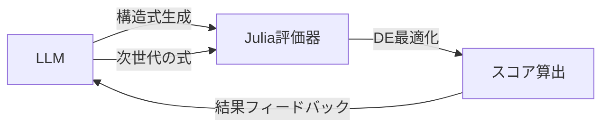

# LLMによるウェイクモデル探査：実行シナリオ

このドキュメントでは、作成したJuliaコードを使用してLLMによる風車ウェイクモデルの自動探査を実行する具体的なシナリオを説明します。

---

## 🎯 全体フロー概要



**役割分担**:
- **LLM**: 構造式の生成（係数は記号のまま）
- **Julia**: 係数の最適化とスコア評価

---

## 📋 Phase 1: 準備と動作確認

### 1.1 環境セットアップ

```bash
cd /Users/Daily/Development/WindTurbineWake/LLMSR

# Julia環境の確認
julia --version

# 依存パッケージのインストール
julia --project=. -e 'using Pkg; Pkg.instantiate()'
```

### 1.2 データの確認

```bash
# データファイルが存在するか確認
ls -lh data/result_I0p3000_C22p0000.csv
```

### 1.3 サンプル実行（動作確認）

```bash
# ヘルプを表示して動作確認
julia --project=. semi_auto_evolution.jl --help
```

**期待される出力**:
```
Phase5: Wind Turbine Wake Model Discovery
📂 Data path: .../data/result_I0p3000_C22p0000.csv
🔬 Evaluating sample models...

▶ Model: Gaussian-like model
  Formula: a * exp(-b*x) * (1 + c*r^2)^(-d)
  ✓ Score (MSE): 0.00123
  ✓ Coefficients: [0.85, 0.032, 1.2, 0.67]
...
```

---

## 🤖 Phase 2: LLM統合（手動反復）

### 2.1 LLMへの初期プロンプト

LLMに以下のような指示を与えます：

```
あなたは風車後流の速度欠損 ΔU(x, r) を記述する代数式を生成するエキスパートです。

【利用可能な変数】
- x: 下流距離（正規化済み）
- r: 半径方向距離（正規化済み）
- k: 乱流運動エネルギー
- omega: 比散逸率
- nut: 渦粘性係数

【係数表記ルール】
- 係数は a, b, c, d, e, ... を使用
- 数値は入れず、記号のみで表現
- Julia構文で記述（例: exp(-b*x)）

【物理的制約】
- x が大きくなると ΔU は減衰すること
- r 方向は対称であること
- 負の速度欠損は非物理的

【タスク】
後流モデルの構造式を5つ提案してください。
各式には簡単な説明（Reason）を付けてください。
```

### 2.2 LLMの応答例

```json
{
  "models": [
    {
      "formula": "a * exp(-b*x) * exp(-c*r^2)",
      "reason": "Classic Gaussian profile with exponential decay",
      "num_coeffs": 3
    },
    {
      "formula": "a * x^(-b) * (1 + c*r^2)^(-d)",
      "reason": "Power-law decay with polynomial radial profile",
      "num_coeffs": 4
    },
    {
      "formula": "a * exp(-b*x) * (1 + c*r^2)^(-d) * (1 + e*nut)",
      "reason": "Includes turbulent viscosity effect",
      "num_coeffs": 5
    }
  ]
}
```

### 2.3 Julia評価スクリプト

`semi_auto_evolution.jl` を使用して評価を行います：

```bash
# 評価の実行（実験名 gpt4_trial）
julia --project=. semi_auto_evolution.jl --evaluate 1 --exp-name gpt4_trial
```

### 2.4 結果をLLMにフィードバック

```
【評価結果】
1. Model: a * exp(-b*x) * (1 + c*r^2)^(-d) * (1 + e*nut)
   Score (MSE): 0.00089
   Coefficients: [0.92, 0.028, 1.1, 0.71, 0.15]

2. Model: a * exp(-b*x) * exp(-c*r^2)
   Score (MSE): 0.00145
   Coefficients: [0.88, 0.031, 1.35]

3. Model: a * x^(-b) * (1 + c*r^2)^(-d)
   Score (MSE): 0.00201
   Coefficients: [1.2, 0.45, 0.98, 0.63]

【次のタスク】
最良モデルを基に、さらに改善された構造式を5つ生成してください。
乱流項（k, omega）の組み込みも検討してください。
```

---

## 🔄 Phase 3: 進化計算ループ（自動化）

### 3.1 進化計算の概要

```
世代0（初期集団）: LLMが20個のランダムな構造式を生成
  ↓
評価: Juliaで各式のスコアを計算
  ↓
世代1: EP（Evolutionary Prompts）に基づき次世代を生成
  - EP1: 多様性重視（全く新しい構造）
  - EP2: 局所改善（ベストモデルの微修正）
  - EP3: 物理性改善（ペナルティが高い項を修正）
  - EP4: 簡素化（過剰に複雑なモデルを削減）
  ↓
評価 → 選択 → 次世代...（20世代繰り返す）
```

### 3.2 自動化スクリプトの実行

`semi_auto_evolution.jl` は単一世代の評価を行うツールです。これを繰り返すことで進化計算を進めます。

```bash
# 初期集団生成
julia --project=. semi_auto_evolution.jl --generate-initial --exp-name gpt4_trial

# 世代1の評価
julia --project=. semi_auto_evolution.jl --evaluate 1 --exp-name gpt4_trial

# （LLMで世代2を生成して保存）

# 世代2の評価
julia --project=. semi_auto_evolution.jl --evaluate 2 --exp-name gpt4_trial
```

### 3.3 EP（Evolutionary Prompts）の詳細

#### EP1: 多様性生成

```
【タスク】
これまでと全く異なる構造の式を5つ生成してください。
- 新しい変数の組み合わせを試す
- 異なる数学関数（log, sqrt, tanh など）を使う
- 項の数を変える
```

#### EP2: 局所改善

```
【現在のベストモデル】
Model: a * exp(-b*x) * (1 + c*r^2)^(-d) * (1 + e*nut)
Score: 0.00089

【タスク】
このモデルを微修正して改善された式を5つ生成してください。
- 指数の次数を変える
- 新しい項を追加
- 係数の位置を変える
```

#### EP3: 物理性改善

```
【問題のあるモデル】
Model: a * exp(b*x) * r^c  ← x が増えると発散（非物理的）
Penalty: 15.3

【タスク】
物理的制約を満たすように修正してください。
- x 減衰: exp(-b*x) のような形
- r 対称性: r^2 や |r| を使う
```

#### EP4: 簡素化

```
【複雑すぎるモデル】
Model: a*exp(-b*x)*c*r^2*exp(-d*r^2)*(1+e*k)*(1+f*omega)*(1+g*nut)
Coeffs: 7個
Score: 0.00085（わずかに改善）

【タスク】
精度を大きく損なわずに簡素化してください。
項を統合したり、寄与の小さい項を削除してください。
```

---

## 📊 Phase 4: 結果の分析と可視化

### 4.1 進化の履歴をプロット

```bash
julia --project=. visualize_evolution.jl --exp-name gpt4_trial
```

### 4.2 最終モデルの検証

```bash
julia --project=. inspect_model.jl --gen 20 --best --exp-name gpt4_trial
```

---

## 🚀 Phase 5: ベンチマーク

```bash
julia --project=. benchmark_models.jl --exp-name gpt4_trial
```

### 5.2 期待される出力

```
Generation 1: Best MSE = 0.00234
Generation 2: Best MSE = 0.00198
Generation 3: Best MSE = 0.00156
...
Generation 20: Best MSE = 0.00047

=== Final Best Model ===
Formula: a * exp(-b*x) * (1 + c*r^2)^(-d) * (1 + e*k^0.5) * (1 + f*nut)
Score: 0.00047
Coefficients: [0.94, 0.025, 1.15, 0.68, 0.22, 0.18]

# 最終結果の保存
save_results("results/{exp_name}/evolution_history.json", all_models, best_scores)

---

## 🎓 次のステップ

1. **物理性ペナルティの実装** (`with_penalty=true` の活用）
2. **Reflective Evolution** (Phase 7): LLMが Reason を分析して自己改善
3. **複数データセットでの検証**: 異なる乱流強度や風車配置での汎化性能
4. **既存モデルとの比較**: Jensen, Bastankhah, Gaussian モデルとのベンチマーク

---

## 📝 補足: LLM APIの選択肢

### オプション1: OpenAI API

```python
import openai

response = openai.ChatCompletion.create(
    model="gpt-4",
    messages=[
        {"role": "system", "content": "You are a wake model expert..."},
        {"role": "user", "content": prompt}
    ]
)

models = parse_response(response)
```

### オプション2: Google Gemini API

```python
import google.generativeai as genai

model = genai.GenerativeModel('gemini-pro')
response = model.generate_content(prompt)
models = parse_response(response.text)
```

### オプション3: Julia からの直接呼び出し

```julia
using HTTP, JSON

function call_llm_api(prompt::String)
    headers = ["Authorization" => "Bearer $API_KEY",
               "Content-Type" => "application/json"]
    
    body = JSON.json(Dict(
        "model" => "gpt-4",
        "messages" => [Dict("role" => "user", "content" => prompt)]
    ))
    
    response = HTTP.post("https://api.openai.com/v1/chat/completions",
                         headers, body)
    
    return JSON.parse(String(response.body))
end
```

---

## ✅ チェックリスト

- [ ] Julia環境のセットアップ完了
- [ ] `main.jl` でサンプルモデルの評価が成功
- [ ] LLM APIの選択と設定
- [ ] 手動で1世代の評価→フィードバック→次世代生成を実行
- [ ] EP1〜EP4のプロンプトテンプレート作成
- [ ] 自動化スクリプト `semi_auto_evolution.jl` の実装
- [ ] 20世代の進化計算を実行
- [ ] 結果の分析と可視化
- [ ] 論文執筆用のデータ整理
