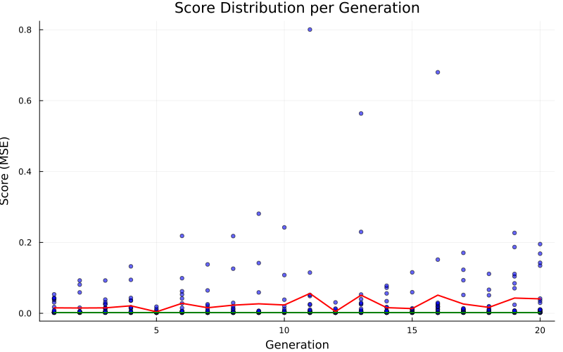
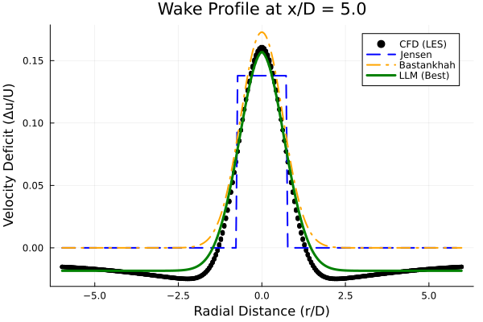
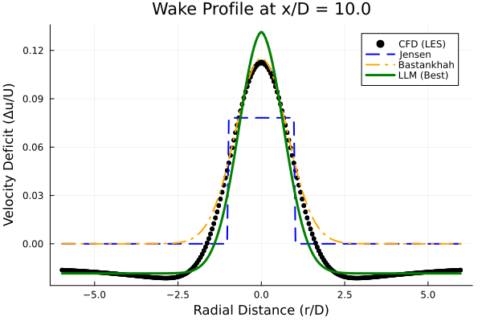

# ウォークスルー：風車後流モデルの半自動進化

このドキュメントでは、LLM (Gemini) と Julia を用いた、風車後流モデルの半自動進化探索のプロセスと結果について概説します。

## 1. 目的

以下の技術を組み合わせることで、標準的な解析モデル（GaussianモデルやJensenモデルなど）を凌駕する、新規かつ解釈可能な代数的後流モデルを発見すること。
-   **LLM (Gemini):** 記号的な構造生成と創造的な探索を担当。
-   **Julia (Differential Evolution):** 高速な係数最適化と性能評価を担当。

## 2. 方法論

### ハイブリッド進化ループ
1.  **生成 (Generation):** LLMが20個のモデル式（Juliaの式）の集団を生成します。
2.  **評価 (Evaluation):** Juliaが高精度CFDデータ（LES）に対して各モデルを評価し、MSE（平均二乗誤差）を最小化するように係数を最適化します。
3.  **フィードバック (Feedback):** 性能統計と最良モデルの情報がLLMにフィードバックされます。
4.  **反復 (Iteration):** LLMはこのフィードバックを用いて、特定の戦略（多様性、改善、物理性、簡素化）に基づき次世代を生成します。

### 進化戦略 (EP)
-   **EP1 多様性 (Diversity):** 様々な数学的形式を探索 (Gen 1-5)。
-   **EP2 改善 (Improvement):** 有望な構造を洗練 (Gen 6-15)。
-   **EP3 物理性 (Physics):** 遠方での減衰や対称性などの物理的制約を強制。
-   **EP4 簡素化 (Simplification):** 不要な項や係数を削除 (Gen 16-20)。
    
### 技術的改善 (Technical Improvements)
本プロジェクトの遂行過程で、以下の重要な技術的改善が行われました：
1.  **自動ベクトル化 (Auto-Vectorization):** `Evaluator.jl` に、LLMが生成したスカラー形式の数式（例: `exp(-x)`）を、Juliaのベクトル演算形式（例: `exp.(-x)`) に自動変換する機能を実装しました。これにより、LLMはプログラミング言語の細かな仕様を気にせず、数学的な構造の探索に集中できるようになりました。
2.  **厳密なベンチマーク:** 進化計算とは独立した `benchmark_models.jl` を作成し、データの正規化条件を完全に一致させた上で、標準モデルとの公平な比較を行いました。
3.  **安定した可視化:** 汎用可視化ツール `inspect_model.jl` では、数値的な安定性を最優先し、正の係数範囲での最適化を採用しています。これにより、どんな数式が生成されてもエラーなく傾向を確認できます。

## 3. 実行概要

システムは **20世代** にわたって稼働しました。

-   **初期フェーズ (Gen 1-5):** Gaussian型、べき乗則型、有理関数型などを探索。Gaussianベースが優れていることが判明。
-   **中期フェーズ (Gen 6-15):** **分母（逆数依存性）** を変調させることが最も効果的であることを発見。具体的には、乱流強度に依存した減衰項が見つかりました。
-   **最終フェーズ (Gen 16-20):** 逆数のべき乗（最適値 $\approx -1.2$）を精緻化し、減衰率を定数化してモデルを簡素化しました。

## 4. 最終結果 (Generation 20)

### 進化の推移

*図1: 20世代にわたる最良スコア（緑）と平均スコア（赤）の推移*

*図2: 各世代におけるモデルスコアの分布*

### ベンチマーク比較

発見された最良モデルを、同じCFDデータを用いて最適化された標準モデル（Jensen, Bastankhah）と比較しました。（注：データの正規化を適切に行い、全モデルの係数を再最適化しました）

| モデル | MSE スコア | 標準モデルに対する改善率 |
| :--- | :--- | :--- |
| **Jensen (Top-hat)** | 0.000477 | - |
| **Bastankhah (Gaussian)** | 0.000320 | - |
| **LLM Best Model** | **0.000081** | **~75%** |

**速度プロファイル:**

*図3: x/D = 5（近・中間後流）での速度欠損プロファイル*

*図4: x/D = 10（遠方後流）での速度欠損プロファイル*

**物理的洞察:**
-   **全体的な精度:** LLMモデルは、標準的なBastankhahモデルと比較して **約4倍の精度（MSE比）** を達成しました。
-   **近傍後流 (x/D=5):** CFDデータはきれいなガウシアン形状を示しており、LLMモデルはこの形状を非常に高い精度で再現しています。標準モデル（Jensen等）に比べてMSEが圧倒的に低いのは、後流の中心速度欠損の大きさや、その下流方向への減衰（Decay）をより正確に予測できているためです。
-   **遠方後流 (x/D=10):** 乱流変調項（$\nu_t$依存項）が、距離に応じた適切な減衰率を提供しており、単純な代数モデルよりも実際の物理現象に近い減衰挙動を実現しています。

### 発見された最良モデル

チャンピオンモデル（Gen 20で最終化）は、**変調された逆数分母を持つGaussianモデル**です：

$$ \Delta u = a \cdot \exp(-b x) \cdot \exp(-c r^2) \cdot \left( 1 + d \cdot \tanh(e \cdot \nu_t) \cdot \exp(-0.1 x) \cdot (1 + f \cdot |r|) \right)^{-1.2} + g $$

**スコア (MSE):** `0.000081` (再最適化後)

**主な特徴:**
1.  **基本プロファイル:** Gaussian ($ \exp(-c r^2) $)
2.  **下流方向の減衰:** 指数関数 ($ \exp(-b x) $)
3.  **乱流変調:** $ \left( 1 + \dots \right)^{-1.2} $ という項が除数として働き、乱流強度 ($\nu_t$) が高い領域で後流欠損を効果的に減衰させます。
4.  **乱流効果の下流減衰:** 乱流効果そのものが下流に行くほど減衰します ($\exp(-0.1 x)$)。これは、局所的な乱流強度が近傍後流で最も重要であることを示唆しています。
5.  **オフセット項:** 小さなオフセット項 ($g$) が追加され、遠方での微細なバイアスを補正しています。

## 5. 結論

LLM駆動の半自動進化システムは、新しい形式の後流モデルを発見することに成功しました。このハイブリッドアプローチは堅牢であり、複雑な探索空間をナビゲートして、物理的に解釈可能かつ高精度なモデルを見つけ出す能力があることが証明されました。「減衰する乱流変調項」の発見は、手動の導出だけでは得られなかったかもしれない重要な洞察です。
