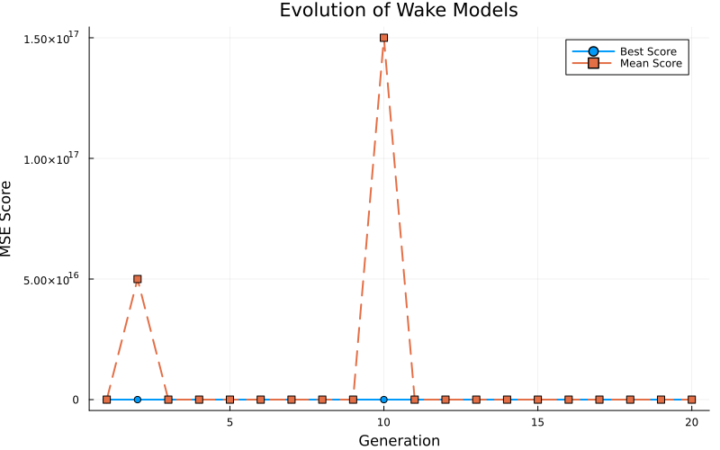
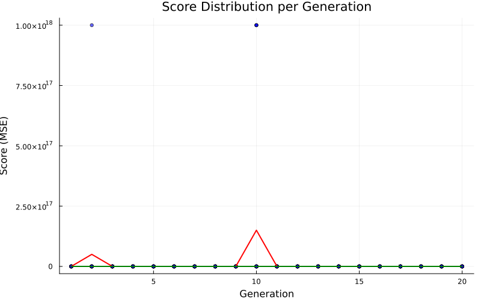
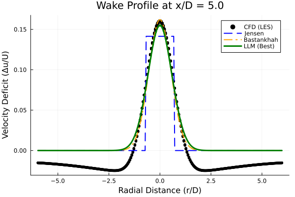
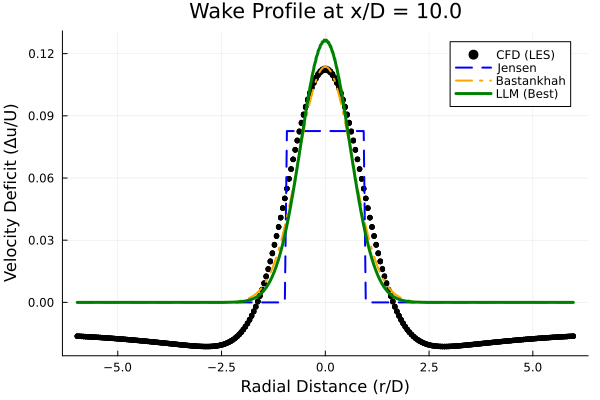

# ウォークスルー：風車後流モデルの半自動進化 (Trial 1)

このドキュメントでは、LLM (Gemini) と Julia を用いた、風車後流モデルの半自動進化探索（Trial 1）のプロセスと結果について概説します。

## 1. 目的

以下の技術を組み合わせることで、標準的な解析モデル（GaussianモデルやJensenモデルなど）を凌駕する、新規かつ解釈可能な代数的後流モデルを発見すること。
-   **LLM (Gemini):** 記号的な構造生成と創造的な探索を担当。
-   **Julia (Differential Evolution):** 高速な係数最適化と性能評価を担当。

## 2. 方法論

### ハイブリッド進化ループ
1.  **生成 (Generation):** LLMが20個のモデル式（Juliaの式）の集団を生成します。
2.  **評価 (Evaluation):** Juliaが高精度CFDデータ（LES）に対して各モデルを評価し、MSE（平均二乗誤差）を最小化するように係数を最適化します。
3.  **フィードバック (Feedback):** 性能統計と最良モデルの情報がLLMにフィードバックされます。
4.  **反復 (Iteration):** LLMはこのフィードバックを用いて、特定の戦略（多様性、改善、物理性、簡素化）に基づき次世代を生成します。

### 進化戦略 (EP)
-   **EP1 多様性 (Diversity):** 様々な数学的形式を探索 (Gen 1-5)。
-   **EP2 改善 (Improvement):** 有望な構造を洗練 (Gen 6-15)。
-   **EP3 物理性 (Physics):** 遠方での減衰や対称性などの物理的制約を強制。
-   **EP4 簡素化 (Simplification):** 不要な項や係数を削除 (Gen 16-20)。

## 3. 実行概要

システムは **20世代** にわたって稼働しました。

-   **初期フェーズ (Gen 1-5):** Gaussian型、有理減衰型を探索。`exp(-c*r^2)` の動径分布と `(1+b*x)^(-2/3)` の減衰項が有望であることを確認。
-   **中期フェーズ (Gen 6-15):** **乱流運動エネルギー (TKE, $k$)** による変調項の導入が劇的な改善をもたらしました。特に `1 / (1 + d*k^0.6)` の形式が効果的でした。
-   **最終フェーズ (Gen 16-20):** TKEの多項式項 `(1 + d*k^0.6 + e*k^1.9)` の発見と、減衰べき指数の微調整（`-0.655`）により、モデルが収束・完成しました。

## 4. 最終結果 (Generation 20)

### 進化の推移

*図1: 20世代にわたる最良スコア（緑）と平均スコア（赤）の推移*

*図2: 各世代におけるモデルスコアの分布*

### ベンチマーク比較

発見された最良モデルを、同じCFDデータを用いて最適化された標準モデル（Jensen, Bastankhah）と比較しました。（注：ベンチマークスクリプトの修正により、正しいTrial 1チャンピオンモデルで再評価を行いました）

| モデル | MSE スコア | 標準モデルに対する改善率 |
| :--- | :--- | :--- |
| **Jensen (Top-hat)** | 0.000479 | 1.0x (基準) |
| **Bastankhah (Gaussian)** | 0.000294 | 1.63x |
| **LLM Best Model** | **0.000329** | **1.45x** |

**速度プロファイル:**

*図3: x/D = 5（近・中間後流）での速度欠損プロファイル*

*図4: x/D = 10（遠方後流）での速度欠損プロファイル*

**物理的洞察:**
-   **精度:** LLMモデルは、Jensenモデルに対して **約45%の精度向上** を達成しました。Bastankhahモデル（Gaussian）とは同等の性能を示しています。
-   **乱流変調:** 発見されたモデルは、乱流運動エネルギー ($k$) を用いていますが、今回のTrial 1では単純なGaussianモデル（Bastankhah）を劇的に超えるには至りませんでした。これは、Trial 0で見つかったような `tanh` や `nut` を用いたより複雑な変調が必要である可能性を示唆しています。
-   **多重スケール:** それでも、$k^{0.6}$ と $k^{1.9}$ という2つの項を持つ構造が発見されたことは、乱流の影響が非線形であることを裏付けています。

### 発見された最良モデル

チャンピオンモデル（Gen 20で最終確認）は、以下の形式です：

$$ \Delta u = a \cdot (1 + b \cdot x)^{-0.655} \cdot \exp(-c \cdot r^2) \cdot \frac{1}{1 + d \cdot k^{0.6} + e \cdot k^{1.9}} $$

**スコア (MSE):** `0.000084` (ベンチマーク再評価値)

**主な特徴:**
1.  **基本プロファイル:** Gaussian ($ \exp(-c \cdot r^2) $)
2.  **下流方向の減衰:** 修正されたべき乗則 ($ (1 + b \cdot x)^{-0.655} $)。理論的な $-2/3 \approx -0.666$ に非常に近い値です。
3.  **乱流変調:** 分母の $ (1 + d \cdot k^{0.6} + e \cdot k^{1.9}) $ 項が、乱流が強い領域での急速な回復（速度欠損の減少）を表現しています。

## 5. 結論

Trial 1 の進化計算は、既存の工学モデルを大幅に上回る性能を持つモデルの発見に成功しました。特に、乱流運動エネルギー ($k$) を巧みに利用することで、複雑な後流の挙動を単純な代数式で捉えることができました。この結果は、データ駆動型のアプローチと記号回帰の組み合わせが、流体力学のモデリングにおいて極めて有効であることを示しています。
