# Model Evolution Lineage

## Evolution Path from Generation 1 to 20

This document traces the evolutionary path of the champion model,
showing how the mathematical structure evolved across generations.

## Evolution Graph

The following diagram shows the lineage from Generation 1 (origin) to Generation 20 (final best model).

**Edge types** indicate the evolution strategy:
- Solid arrow (→): Improvement (EP2)
- Dashed arrow (-→): Simplification (EP4)
- Bold arrow (⇒): Physics Fix (EP3)
- Wavy arrow (~→): New Structure (EP1)

**Node colors:**
- 🟨 Gold node: Global Best Model (Lowest Score)
- 🟩 Green node: Final Best Model (Gen 20)
- 🟥 Pink nodes: Key milestones
- ⬜ White nodes: Intermediate generations

```mermaid
flowchart TD
    G1_13["Gen1 0.000 e-3<br/>(a+b·sin(c·x))/(d+cosh(x))"]
    G20_16["Gen20 1.032 e-3<br/>a·(1+b·x)^-2)·exp(-c·r^2)"]


    classDef milestone fill:#f96,stroke:#333,stroke-width:4px
    classDef final fill:#9f6,stroke:#333,stroke-width:4px
    classDef globalBest fill:#ff9,stroke:#f60,stroke-width:6px
    class G20_16 final
    class G1_13 globalBest
```




## Model Formulas

| Generation | Score (×10⁻³) | Formula | Coefficients |
|------------|---------------|---------|--------------|
| Gen1 | 0.000 | $(a + b \cdot sin(c \cdot x)) / (d + cosh(x))$ | `[-0.3935, -0.5600, -55.5130, 92.5953]` |
| Gen20 | 1.032 | $a \cdot (1 + b \cdot x)^{-2} \cdot exp(-c \cdot r^2)$ | `[44.4247, 4.2394, 1.6566]` |

## Major Milestones

### Generation 1: Initial exploration

**Strategy**: Diversity

**Score**: 0.0

**Formula**:
```
(a + b*sin(c*x)) / (d + cosh(x))
```

**Reasoning**: Stage 1 Diversity Generation: (a + b*sin(c*x)) / (d + cosh(x))

## Complete Evolution History

### Generation 1

- **Strategy**: Diversity
- **Score**: 0.0

**Formula**:
```
(a + b*sin(c*x)) / (d + cosh(x))
```

_Stage 1 Diversity Generation: (a + b*sin(c*x)) / (d + cosh(x))_

---

### Generation 20

- **Strategy**: Random
- **Score**: 0.00103222 (↑ 1.6377631420224523e20%)

**Formula**:
```
a * (1 + b*x)^(-2) * exp(-c*r^2)
```

_Exploring new structure to escape local optima. P1/P2 focus._

---

## Evolution Summary Table

| Gen | Strategy | Score | Key Change |
|-----|----------|-------|------------|
|  1 | Diversity | 0.000000 |  |
| 20 | Random | 0.001032 |  |

## Statistical Summary

- **Initial Score (Gen 1)**: 0.0
- **Final Score (Gen 2)**: 0.00103222
- **Total Improvement**: -1.6377631420224523e20%
- **Best Score**: 0.0 (Gen 1)

