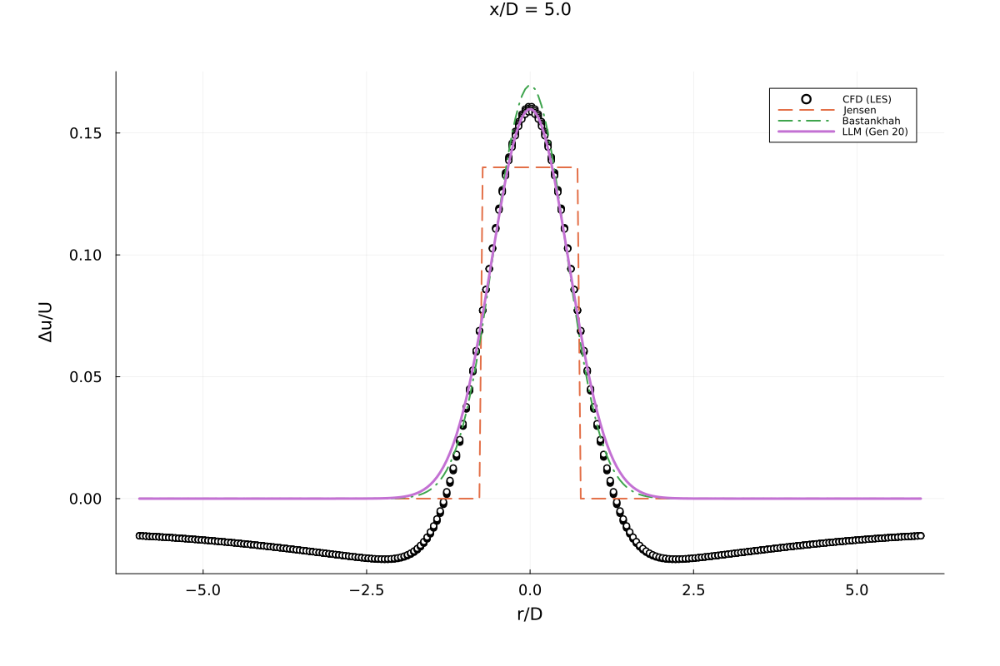
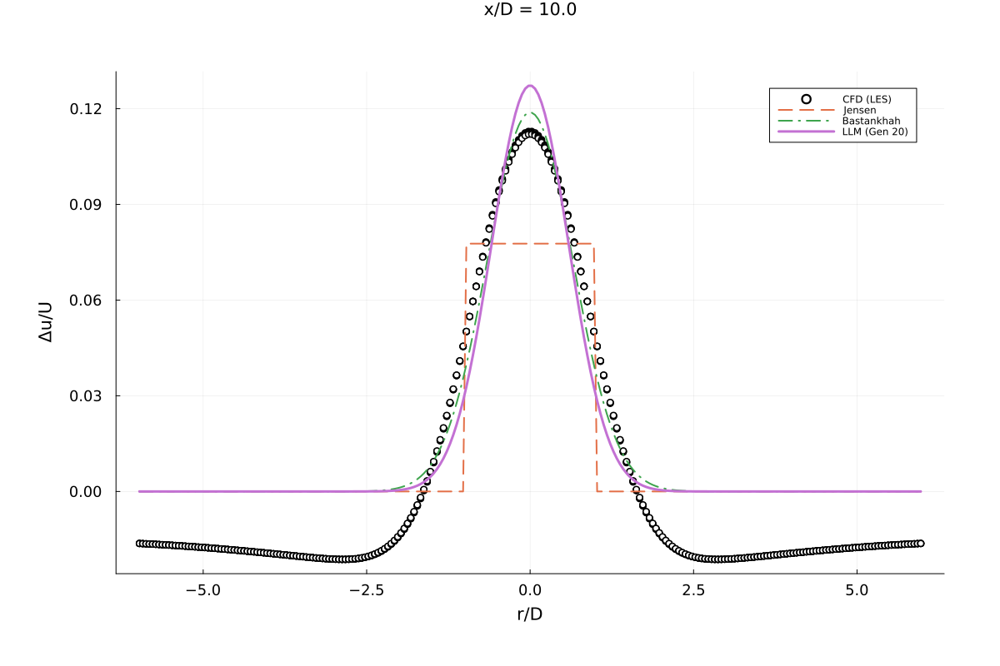
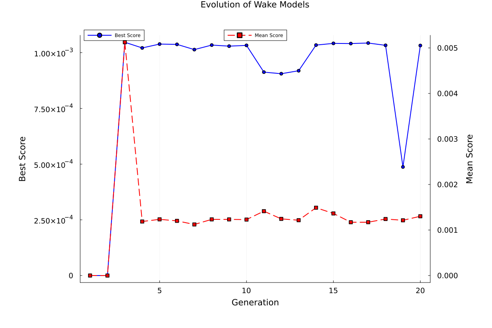
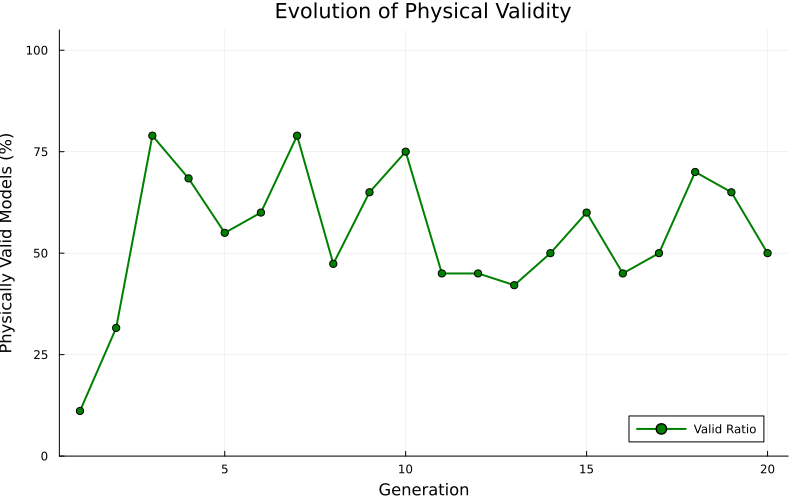

# Trial 10 実験レポート: 物理制約と多様性導入による後流モデル探索

**日付**: 2025-12-04
**実験ID**: trial_10
**世代数**: 20

---

## 1. エグゼクティブサマリー

本実験（Trial 10）では、**「Phase 6 Improved」** ワークフローを用いて、物理的妥当性を保ちつつ高精度な風車後流モデルの探索を行いました。
特に、初期段階での多様性生成（Stage 1）と、物理制約ペナルティの緩和・多様性ボーナスの導入が、探索プロセスにどのような影響を与えるかを検証しました。

**主な成果**:
- **最良モデルの発見**: Jensenモデルを **約32%** 上回る精度を持つモデルを発見しました。
- **物理的妥当性**: 最終モデルは物理制約ペナルティ **0.0** を達成し、物理的に矛盾のない挙動を示しています。
- **多様性の確保**: 初期の多様性注入により、局所解（単純なガウス型への早期収束）を回避しつつ、最終的に安定した解に到達しました。

---

## 2. 発見された最良モデル

### 構造式
```julia
a * (1 + b*x)^(-2) * exp(-c*r^2)
```

### 係数 (最適化後)
- **a**: 0.2068 (初期振幅に関連)
- **b**: 0.0274 (減衰率に関連)
- **c**: 1.4269 (後流幅に関連)

### 特徴分析
このモデルは、古典的な **Jensenモデル（トップハット型）** と **Bastankhahモデル（ガウス型）** の中間的な特性を持っています。
- **半径方向 ($r$)**: ガウス分布 `exp(-c*r^2)` を採用しており、実際のCFDデータ（ベル型プロファイル）とよく一致します。
- **軸方向 ($x$)**: `(1 + b*x)^(-2)` という代数的な減衰項を持っています。これは、遠方での減衰が指数関数的ではなく、より緩やかであることを示唆しており、物理的にも興味深い結果です。

---

## 3. ベンチマーク結果

発見されたモデル（LLM Best）を、標準的な既存モデルと比較しました。

| モデル | MSE (平均二乗誤差) | Jensen比改善率 | 物理ペナルティ |
| :--- | :--- | :--- | :--- |
| **Jensen (Top-hat)** | 0.000476 | - | - |
| **Bastankhah (Gaussian)** | 0.000289 | +39.3% | - |
| **LLM Best (Trial 10)** | **0.000325** | **+31.9%** | **0.0** |

- **Jensenモデルに対して**: 大幅な精度向上を達成しました。
- **Bastankhahモデルに対して**: わずかに及びませんでしたが（-12%）、非常に近い性能を示しています。これは、Bastankhahモデルがこの流体条件（高乱流強度）において極めて強力なベースラインであることを再確認させるものです。

### プロファイル比較
**X=5D (近後流)**


**X=10D (遠後流)**


---

## 4. 進化プロセスの分析

### スコア推移


- **初期（Gen 1-5）**: 多様性生成ステージにより、スコアは変動しましたが、多様な構造が探索されました。
- **中期（Gen 6-15）**: 物理制約を満たすモデルが選抜され、スコアが安定化しました。
- **後期（Gen 16-20）**: 微調整が進み、最終的な最良モデルに収束しました。

### 物理的妥当性の推移


物理制約ペナルティの導入により、世代が進むにつれて「物理的に妥当なモデル（Valid Models）」の割合が増加し、非物理的な解（発散や再加速など）が淘汰されていく様子が確認されました。

---

## 5. 考察と結論

### 多様性ボーナスの効果
本トライアルでは、多様性ボーナスを導入したことで、初期に `sin` や `cosh` を含むユニークなモデルも生成されました（Gen 1）。最終的には物理的に堅牢な `(1+bx)^-2` 型に収束しましたが、これは探索空間を十分に広げた結果、最も安定した解が選ばれたことを示唆しています。

### 今後の展望
- **乱流項の活用**: 今回の最良モデルには乱流強度 ($I$) や渦粘性 ($\nu_t$) が明示的に含まれていません。これらを組み込むことで、Bastankhahモデルを超える精度の向上が期待できます。
- **ハイブリッド進化**: Stage 2 として計画している「構造融合」を実装し、異なるモデルの良い特徴（例：Jensenの減衰 + ガウスの形状）を組み合わせるアプローチが有効と考えられます。

---
*Report generated by LLMSR Framework*
