# Model Evolution Lineage

## Evolution Path from Generation 1 to 20

This document traces the evolutionary path of the champion model,
showing how the mathematical structure evolved across generations.

## Evolution Graph

The following diagram shows the lineage from Generation 1 (origin) to Generation 20 (final best model).

**Edge types** indicate the evolution strategy:
- Solid arrow (→): Improvement (EP2)
- Dashed arrow (-→): Simplification (EP4)
- Bold arrow (⇒): Physics Fix (EP3)
- Wavy arrow (~→): New Structure (EP1)

**Node colors:**
- 🟨 Gold node: Global Best Model (Lowest Score)
- 🟩 Green node: Final Best Model (Gen 20)
- 🟥 Pink nodes: Key milestones
- ⬜ White nodes: Intermediate generations

```mermaid
flowchart TD
    G1_1["Gen1 1.990 e-3<br/>a·exp(-b·x)·exp(-c·r^2)"]
    G2_2["Gen2 12.199 e-3<br/>a·(1+b·x)^-2)·(1+c·r^2)^-1)+d"]
    G4_1["Gen4 4.511 e-3<br/>a·(1+b·x)^-2)·(1+c·r^2)^-1)+d"]
    G5_1["Gen5 260.869 e-3<br/>a·(1+b·x)^-2)·(1+c·r^2)^-1)+d"]
    G6_1["Gen6 2.501 e-3<br/>a·(1+b·x)^-2)·(1+c·r^2)^-1)+d"]
    G7_1["Gen7 7.529 e-3<br/>a·(1+b·x)^-2)·(1+c·r^2)^-1)+d"]
    G8_1["Gen8 2.171 e-3<br/>a·(1+b·x)^-2)·(1+c·r^2)^-1)+d"]
    G9_1["Gen9 2.045 e-3<br/>a·(1+b·x)^-2)·(1+c·r^2)^-1)+d"]
    G10_1["Gen10 10.626 e-3<br/>a·(1+b·x)^-2)·(1+c·r^2)^-1)+d"]
    G12_1["Gen12 4.561 e-3<br/>a·(1+b·x)^-2)·(1+c·r^2)^-1)+d"]
    G12_18["Gen12 0.964 e-3<br/>a·(1+b·x)^-2)·(1+c·r^2)^-1)+d·(1..."]
    G13_1["Gen13 931.951 e-3<br/>a·(1+b·x)^-2)·(1+c·r^2)^-1)+d"]
    G14_1["Gen14 20.467 e-3<br/>a·(1+b·x)^-2)·(1+c·r^2)^-1)+d"]
    G15_1["Gen15 59.987 e-3<br/>a·(1+b·x)^-2)·(1+c·r^2)^-1)+d"]
    G16_1["Gen16 5.151 e-3<br/>a·(1+b·x)^-2)·(1+c·r^2)^-1)+d"]
    G17_1["Gen17 2.573 e-3<br/>a·(1+b·x)^-2)·(1+c·r^2)^-1)+d"]
    G18_1["Gen18 2.036 e-3<br/>a·(1+b·x)^-2)·(1+c·r^2)^-1)+d"]
    G19_1["Gen19 10.149 e-3<br/>a·(1+b·x)^-2)·(1+c·r^2)^-1)+d"]
    G20_11["Gen20 1.172 e-3<br/>a·(1+b·x)^-2)·(1+c·r^2)^-1)+d·(1..."]

    G1_1 --> |Improvement| G2_2
    G2_2 --> |Improvement| G4_1
    G4_1 --> |Improvement| G5_1
    G5_1 --> |Improvement| G6_1
    G6_1 --> |Improvement| G7_1
    G7_1 --> |Improvement| G8_1
    G8_1 --> |Improvement| G9_1
    G9_1 --> |Improvement| G10_1
    G10_1 --> |Improvement| G12_1
    G12_1 --> |Improvement| G13_1
    G13_1 --> |Improvement| G14_1
    G14_1 --> |Improvement| G15_1
    G15_1 --> |Improvement| G16_1
    G16_1 --> |Improvement| G17_1
    G17_1 --> |Improvement| G18_1
    G18_1 --> |Improvement| G19_1
    G19_1 --> |Improvement| G20_11

    classDef milestone fill:#f96,stroke:#333,stroke-width:4px
    classDef final fill:#9f6,stroke:#333,stroke-width:4px
    classDef globalBest fill:#ff9,stroke:#f60,stroke-width:6px
    class G1_1 milestone
    class G5_1 milestone
    class G10_1 milestone
    class G13_1 milestone
    class G20_11 final
    class G12_18 globalBest
```




## Model Formulas

| Generation | Score (×10⁻³) | Formula | Coefficients |
|------------|---------------|---------|--------------|
| Gen1 | 1.990 | $a \cdot exp(-b \cdot x) \cdot exp(-c \cdot r^2)$ | `[44.2431, 2.3517, 63.5171]` |
| Gen2 | 12.199 | $a \cdot (1 + b \cdot x)^{-2} \cdot (1 + c \cdot r^2)^{-1} + d$ | `[-45.3445, 65.8509, -0.6180, 0.1031]` |
| Gen4 | 4.511 | $a \cdot (1 + b \cdot x)^{-2} \cdot (1 + c \cdot r^2)^{-1} + d$ | `[95.7175, -88.9265, 20.5258, -0.0460]` |
| Gen5 | 260.869 | $a \cdot (1 + b \cdot x)^{-2} \cdot (1 + c \cdot r^2)^{-1} + d$ | `[92.2923, 87.5671, 8.1737, -0.5050]` |
| Gen6 | 2.501 | $a \cdot (1 + b \cdot x)^{-2} \cdot (1 + c \cdot r^2)^{-1} + d$ | `[-64.4546, -19.3810, -29.6442, -0.0086]` |
| Gen7 | 7.529 | $a \cdot (1 + b \cdot x)^{-2} \cdot (1 + c \cdot r^2)^{-1} + d$ | `[48.3591, -44.7944, -67.9861, -0.0699]` |
| Gen8 | 2.171 | $a \cdot (1 + b \cdot x)^{-2} \cdot (1 + c \cdot r^2)^{-1} + d$ | `[-6.2620, 93.7249, 61.6699, 0.0151]` |
| Gen9 | 2.045 | $a \cdot (1 + b \cdot x)^{-2} \cdot (1 + c \cdot r^2)^{-1} + d$ | `[-4.7325, -39.2565, -46.9188, 0.0031]` |
| Gen10 | 10.626 | $a \cdot (1 + b \cdot x)^{-2} \cdot (1 + c \cdot r^2)^{-1} + d$ | `[-40.7491, 32.4785, -14.1064, -0.0891]` |
| Gen12 | 4.561 | $a \cdot (1 + b \cdot x)^{-2} \cdot (1 + c \cdot r^2)^{-1} + d$ | `[16.4910, 18.6320, 63.0375, -0.0466]` |
| Gen12 | 0.964 | $a \cdot (1 + b \cdot x)^{-2} \cdot (1 + c \cdot r^2)^{-1} + d \cdot (1 + e \cdot x^2)^{-1}$ | `[5.1898, 1.0310, 4.2593, 36.9221, -89.9727]` |
| Gen13 | 931.951 | $a \cdot (1 + b \cdot x)^{-2} \cdot (1 + c \cdot r^2)^{-1} + d$ | `[70.7094, 32.3704, -42.3476, -0.9605]` |
| Gen14 | 20.467 | $a \cdot (1 + b \cdot x)^{-2} \cdot (1 + c \cdot r^2)^{-1} + d$ | `[-34.9859, -61.5554, -35.8113, 0.1395]` |
| Gen15 | 59.987 | $a \cdot (1 + b \cdot x)^{-2} \cdot (1 + c \cdot r^2)^{-1} + d$ | `[-80.1331, -77.4912, -7.0663, 0.2445]` |
| Gen16 | 5.151 | $a \cdot (1 + b \cdot x)^{-2} \cdot (1 + c \cdot r^2)^{-1} + d$ | `[-67.3887, 15.5461, 86.7781, 0.0591]` |
| Gen17 | 2.573 | $a \cdot (1 + b \cdot x)^{-2} \cdot (1 + c \cdot r^2)^{-1} + d$ | `[-40.5801, -97.0561, 35.0555, 0.0268]` |
| Gen18 | 2.036 | $a \cdot (1 + b \cdot x)^{-2} \cdot (1 + c \cdot r^2)^{-1} + d$ | `[-50.0471, -28.8320, -83.2306, 0.0046]` |
| Gen19 | 10.149 | $a \cdot (1 + b \cdot x)^{-2} \cdot (1 + c \cdot r^2)^{-1} + d$ | `[33.4423, 3.5535, -73.4809, -0.0162]` |
| Gen20 | 1.172 | $a \cdot (1 + b \cdot x)^{-2} \cdot (1 + c \cdot r^2)^{-1} + d \cdot (1 + e \cdot x + f \cdot r^2)^{-1}$ | `[14.2417, -57.0760, -9.1065, -8.2418, -17.9066, -56.1245]` |

## Major Milestones

### Generation 1: Initial exploration

**Strategy**: EP1

**Score**: 0.00199015

**Formula**:
```
a * exp(-b*x) * exp(-c*r^2)
```

**Reasoning**: Standard Gaussian wake model

### Generation 3: Simplified structure

**Strategy**: EP2

**Score**: 0.0045115

**Formula**:
```
a * (1 + b*x)^(-2) * (1 + c*r^2)^(-1) + d
```

**Reasoning**: Re-introducing Gen 2 Champion (Elite Strategy)

### Generation 6: TKE term refinement

**Strategy**: EP2

**Score**: 0.00752864

**Formula**:
```
a * (1 + b*x)^(-2) * (1 + c*r^2)^(-1) + d
```

**Reasoning**: Elite: Keeping the best model

### Generation 8: Near-wake correction added

**Strategy**: EP2

**Score**: 0.0020451

**Formula**:
```
a * (1 + b*x)^(-2) * (1 + c*r^2)^(-1) + d
```

**Reasoning**: Elite: Keeping the best model

### Generation 10: Removal of near-wake term

**Strategy**: EP2

**Score**: 0.00456137

**Formula**:
```
a * (1 + b*x)^(-2) * (1 + c*r^2)^(-1) + d
```

**Reasoning**: Elite: Re-introducing Gen 10 Champion (Retry)

### Generation 11: Re-addition of near-wake term

**Strategy**: EP3

**Score**: 0.00096366

**Formula**:
```
a * (1 + b*x)^(-2) * (1 + c*r^2)^(-1) + d * (1 + e*x^2)^(-1)
```

**Reasoning**: Offset decaying as 1/x^2 (faster physics decay)

### Generation 13: TKE power optimization

**Strategy**: EP2

**Score**: 0.02046725

**Formula**:
```
a * (1 + b*x)^(-2) * (1 + c*r^2)^(-1) + d
```

**Reasoning**: Elite: Keeping the best model

### Generation 17: Decay rate fine-tuning

**Strategy**: EP2

**Score**: 0.00203606

**Formula**:
```
a * (1 + b*x)^(-2) * (1 + c*r^2)^(-1) + d
```

**Reasoning**: Elite: Clone 1

## Complete Evolution History

### Generation 1

- **Strategy**: EP1
- **Score**: 0.00199015

**Formula**:
```
a * exp(-b*x) * exp(-c*r^2)
```

_Standard Gaussian wake model_

---

### Generation 2

- **Strategy**: EP2
- **Score**: 0.01219945 (↑ 512.99%)

**Formula**:
```
a * (1 + b*x)^(-2) * (1 + c*r^2)^(-1) + d
```

_Added constant offset to best model_

---

### Generation 4

- **Strategy**: EP2
- **Score**: 0.0045115 (↓ 63.02%)

**Formula**:
```
a * (1 + b*x)^(-2) * (1 + c*r^2)^(-1) + d
```

_Re-introducing Gen 2 Champion (Elite Strategy)_

---

### Generation 5

- **Strategy**: EP2
- **Score**: 0.26086887 (↑ 5682.31%)

**Formula**:
```
a * (1 + b*x)^(-2) * (1 + c*r^2)^(-1) + d
```

_Elite: Keeping the best model_

---

### Generation 6

- **Strategy**: EP2
- **Score**: 0.00250085 (↓ 99.04%)

**Formula**:
```
a * (1 + b*x)^(-2) * (1 + c*r^2)^(-1) + d
```

_Elite: Keeping the best model_

---

### Generation 7

- **Strategy**: EP2
- **Score**: 0.00752864 (↑ 201.04%)

**Formula**:
```
a * (1 + b*x)^(-2) * (1 + c*r^2)^(-1) + d
```

_Elite: Keeping the best model_

---

### Generation 8

- **Strategy**: EP2
- **Score**: 0.00217125 (↓ 71.16%)

**Formula**:
```
a * (1 + b*x)^(-2) * (1 + c*r^2)^(-1) + d
```

_Elite: Keeping the best model_

---

### Generation 9

- **Strategy**: EP2
- **Score**: 0.0020451 (↓ 5.81%)

**Formula**:
```
a * (1 + b*x)^(-2) * (1 + c*r^2)^(-1) + d
```

_Elite: Keeping the best model_

---

### Generation 10

- **Strategy**: EP2
- **Score**: 0.01062638 (↑ 419.6%)

**Formula**:
```
a * (1 + b*x)^(-2) * (1 + c*r^2)^(-1) + d
```

_Elite: Keeping the best model_

---

### Generation 12

- **Strategy**: EP2
- **Score**: 0.00456137 (↓ 57.08%)

**Formula**:
```
a * (1 + b*x)^(-2) * (1 + c*r^2)^(-1) + d
```

_Elite: Re-introducing Gen 10 Champion (Retry)_

---

### Generation 12

- **Strategy**: EP3
- **Score**: 0.00096366 (↓ 78.87%)

**Formula**:
```
a * (1 + b*x)^(-2) * (1 + c*r^2)^(-1) + d * (1 + e*x^2)^(-1)
```

_Offset decaying as 1/x^2 (faster physics decay)_

---

### Generation 13

- **Strategy**: EP2
- **Score**: 0.93195138 (↑ 96609.8%)

**Formula**:
```
a * (1 + b*x)^(-2) * (1 + c*r^2)^(-1) + d
```

_Elite: Keeping the best model_

---

### Generation 14

- **Strategy**: EP2
- **Score**: 0.02046725 (↓ 97.8%)

**Formula**:
```
a * (1 + b*x)^(-2) * (1 + c*r^2)^(-1) + d
```

_Elite: Keeping the best model_

---

### Generation 15

- **Strategy**: EP2
- **Score**: 0.05998728 (↑ 193.09%)

**Formula**:
```
a * (1 + b*x)^(-2) * (1 + c*r^2)^(-1) + d
```

_Elite: Keeping the best model_

---

### Generation 16

- **Strategy**: EP2
- **Score**: 0.0051507 (↓ 91.41%)

**Formula**:
```
a * (1 + b*x)^(-2) * (1 + c*r^2)^(-1) + d
```

_Elite: Keeping the best model_

---

### Generation 17

- **Strategy**: EP2
- **Score**: 0.00257309 (↓ 50.04%)

**Formula**:
```
a * (1 + b*x)^(-2) * (1 + c*r^2)^(-1) + d
```

_Elite: Clone 1 (Maximize chance of good optimization)_

---

### Generation 18

- **Strategy**: EP2
- **Score**: 0.00203606 (↓ 20.87%)

**Formula**:
```
a * (1 + b*x)^(-2) * (1 + c*r^2)^(-1) + d
```

_Elite: Clone 1_

---

### Generation 19

- **Strategy**: EP2
- **Score**: 0.01014914 (↑ 398.47%)

**Formula**:
```
a * (1 + b*x)^(-2) * (1 + c*r^2)^(-1) + d
```

_Elite: Clone 1_

---

### Generation 20

- **Strategy**: EP2
- **Score**: 0.00117237 (↓ 88.45%)

**Formula**:
```
a * (1 + b*x)^(-2) * (1 + c*r^2)^(-1) + d * (1 + e*x + f*r^2)^(-1)
```

_Grand Unification: Rational Offset_

---

## Evolution Summary Table

| Gen | Strategy | Score | Key Change |
|-----|----------|-------|------------|
|  1 | EP1 | 0.001990 |  |
|  2 | EP2 | 0.012199 |  |
|  4 | EP2 | 0.004511 |  |
|  5 | EP2 | 0.260869 |  |
|  6 | EP2 | 0.002501 |  |
|  7 | EP2 | 0.007529 |  |
|  8 | EP2 | 0.002171 |  |
|  9 | EP2 | 0.002045 |  |
| 10 | EP2 | 0.010626 |  |
| 12 | EP2 | 0.004561 |  |
| 12 | EP3 | 0.000964 | x^{2} |
| 13 | EP2 | 0.931951 |  |
| 14 | EP2 | 0.020467 |  |
| 15 | EP2 | 0.059987 |  |
| 16 | EP2 | 0.005151 |  |
| 17 | EP2 | 0.002573 |  |
| 18 | EP2 | 0.002036 |  |
| 19 | EP2 | 0.010149 |  |
| 20 | EP2 | 0.001172 |  |

## Statistical Summary

- **Initial Score (Gen 1)**: 0.00199015
- **Final Score (Gen 19)**: 0.00117237
- **Total Improvement**: 41.09%
- **Best Score**: 0.00096366 (Gen 11)

