# Model Evolution Lineage

## Evolution Path from Generation 1 to 20

This document traces the evolutionary path of the champion model,
showing how the mathematical structure evolved across generations.

## Evolution Graph

The following diagram shows the lineage from Generation 1 (origin) to Generation 20 (final best model).

**Edge types** indicate the evolution strategy:
- Solid arrow (→): Improvement (EP2)
- Dashed arrow (-→): Simplification (EP4)
- Bold arrow (⇒): Physics Fix (EP3)
- Wavy arrow (~→): New Structure (EP1)

**Node colors:**
- 🟨 Gold node: Global Best Model (Lowest Score)
- 🟩 Green node: Final Best Model (Gen 20)
- 🟥 Pink nodes: Key milestones
- ⬜ White nodes: Intermediate generations

```mermaid
flowchart TD
    G1_11["Gen1 0.932 e-3<br/>a·(1+b·sqrt(x))^-2)·exp(-c·r^2)"]
    G2_4["Gen2 0.722 e-3<br/>a·(1+b·sqrt(x))^-2)·(1+c·r^2+d·r^4)^..."]
    G3_11["Gen3 0.750 e-3<br/>a·(1+b·sqrt(x))^-2)·(1+c·r^2+d·r^4)^..."]
    G4_1["Gen4 1.220 e-3<br/>a·(1+b·sqrt(x))^-2)·(1+c·r^2+d·r^4)^..."]
    G4_10["Gen4 0.455 e-3<br/>a·(1+b·sqrt(x))^-2.5)·(1+c·r^2+d·r^4..."]
    G16_6["Gen16 19.459 e-3<br/>a·(1+b·sqrt(x))^-2)·(1+c·r^2+d·r^4)^..."]
    G17_1["Gen17 21.049 e-3<br/>a·(1+b·sqrt(x))^-2)·(1+c·r^2+d·r^4)^..."]
    G18_1["Gen18 25.418 e-3<br/>a·(1+b·sqrt(x))^-2)·(1+c·r^2+d·r^4)^..."]
    G19_1["Gen19 2.389 e-3<br/>a·(1+b·sqrt(x))^-2)·(1+c·r^2+d·r^4)^..."]
    G20_17["Gen20 1.349 e-3<br/>a·(1+b·x)^-2)·(1+c·r^2)^-1)"]

    G1_11 --> |Improvement| G2_4
    G2_4 --> |Improvement| G3_11
    G3_11 --> |Improvement| G4_1
    G3_11 --> |Improvement| G4_10
    G4_1 --> |Improvement| G16_6
    G16_6 --> |Improvement| G17_1
    G17_1 --> |Improvement| G18_1
    G18_1 --> |Improvement| G19_1
    G19_1 ==> |Physics Fix| G20_17

    classDef milestone fill:#f96,stroke:#333,stroke-width:4px
    classDef final fill:#9f6,stroke:#333,stroke-width:4px
    classDef globalBest fill:#ff9,stroke:#f60,stroke-width:6px
    class G1_11 milestone
    class G2_4 milestone
    class G16_6 milestone
    class G20_17 final
    class G4_10 globalBest
```




## Model Formulas

| Generation | Score (×10⁻³) | Formula | Coefficients |
|------------|---------------|---------|--------------|
| Gen1 | 0.932 | $a \cdot (1 + b \cdot sqrt(x))^{-2} \cdot exp(-c \cdot r^2)$ | `[97.8975, 14.5541, 2.5721]` |
| Gen2 | 0.722 | $a \cdot (1 + b \cdot sqrt(x))^{-2} \cdot (1 + c \cdot r^2 + d \cdot r^4)^{-1}$ | `[2.9514, 1.5019, -6.6565, 53.5455]` |
| Gen3 | 0.750 | $a \cdot (1 + b \cdot sqrt(x))^{-2} \cdot (1 + c \cdot r^2 + d \cdot r^4)^{-1} \cdot (1 + e \cdot x)$ | `[-14.9885, -64.2493, 14.0668, 4.1353, -56.7185]` |
| Gen4 | 1.220 | $a \cdot (1 + b \cdot sqrt(x))^{-2} \cdot (1 + c \cdot r^2 + d \cdot r^4)^{-1} \cdot (1 + e \cdot x + f \cdot x^2)$ | `[-9.1745, 86.5309, 17.9121, 10.6640, -11.5938, -10.7482]` |
| Gen4 | 0.455 | $a \cdot (1 + b \cdot sqrt(x))^{-2.5} \cdot (1 + c \cdot r^2 + d \cdot r^4)^{-1} \cdot (1 + e \cdot x)$ | `[81.8311, 53.4407, 3.4980, 4.0883, 78.0886]` |
| Gen16 | 19.459 | $a \cdot (1 + b \cdot sqrt(x))^{-2} \cdot (1 + c \cdot r^2 + d \cdot r^4)^{-1} + e$ | `[82.7520, -91.0228, 2.2604, 53.5783, -0.1284]` |
| Gen17 | 21.049 | $a \cdot (1 + b \cdot sqrt(x))^{-2} \cdot (1 + c \cdot r^2 + d \cdot r^4)^{-1} + e$ | `[-79.4405, 75.1750, -83.2198, -2.6215, -0.1341]` |
| Gen18 | 25.418 | $a \cdot (1 + b \cdot sqrt(x))^{-2} \cdot (1 + c \cdot r^2 + d \cdot r^4)^{-1} + e$ | `[76.7847, 11.4228, -2.0589, -44.1403, 0.1409]` |
| Gen19 | 2.389 | $a \cdot (1 + b \cdot sqrt(x))^{-2} \cdot (1 + c \cdot r^2 + d \cdot r^4)^{-1} + e$ | `[7.8122, -99.5334, 1.7524, 10.5762, -0.0149]` |
| Gen20 | 1.349 | $a \cdot (1 + b \cdot x)^{-2} \cdot (1 + c \cdot r^2)^{-1}$ | `[87.8884, -6.3939, 9.1800]` |

## Major Milestones

### Generation 1: Initial exploration

**Strategy**: EP1

**Score**: 0.00093229

**Formula**:
```
a * (1 + b*sqrt(x))^(-2) * exp(-c*r^2)
```

**Reasoning**: Sqrt(x) decay rate

### Generation 3: Simplified structure

**Strategy**: EP2

**Score**: 0.00075

**Formula**:
```
a * (1 + b*sqrt(x))^(-2) * (1 + c*r^2 + d*r^4)^(-1) * (1 + e*x)
```

**Reasoning**: EP2: Gen2-ID4 with linear x correction

### Generation 6: TKE term refinement

**Strategy**: EP5

**Score**: 0.01945872

**Formula**:
```
a * (1 + b*sqrt(x))^(-2) * (1 + c*r^2 + d*r^4)^(-1) + e
```

**Reasoning**: EP5: Gen4-ID1 (Simpler base) with constant offset

### Generation 8: Near-wake correction added

**Strategy**: EP5

**Score**: 0.02541754

**Formula**:
```
a * (1 + b*sqrt(x))^(-2) * (1 + c*r^2 + d*r^4)^(-1) + e
```

**Reasoning**: EP5: Keep refining the best model (Gen17-ID1)

### Generation 10: Removal of near-wake term

**Strategy**: EP3

**Score**: 0.00134875

**Formula**:
```
a * (1 + b*x)^(-2) * (1 + c*r^2)^(-1)
```

**Reasoning**: EP3: Baseline check

## Complete Evolution History

### Generation 1

- **Strategy**: EP1
- **Score**: 0.00093229

**Formula**:
```
a * (1 + b*sqrt(x))^(-2) * exp(-c*r^2)
```

_Sqrt(x) decay rate_

---

### Generation 2

- **Strategy**: EP2
- **Score**: 0.00072166 (↓ 22.59%)

**Formula**:
```
a * (1 + b*sqrt(x))^(-2) * (1 + c*r^2 + d*r^4)^(-1)
```

_EP2: Gen1-ID11 with polynomial radial decay_

---

### Generation 3

- **Strategy**: EP2
- **Score**: 0.00075 (↑ 3.93%)

**Formula**:
```
a * (1 + b*sqrt(x))^(-2) * (1 + c*r^2 + d*r^4)^(-1) * (1 + e*x)
```

_EP2: Gen2-ID4 with linear x correction_

---

### Generation 4

- **Strategy**: EP2
- **Score**: 0.00122013 (↑ 62.68%)

**Formula**:
```
a * (1 + b*sqrt(x))^(-2) * (1 + c*r^2 + d*r^4)^(-1) * (1 + e*x + f*x^2)
```

_EP2: Gen3-ID11 with quadratic x correction_

---

### Generation 4

- **Strategy**: EP2
- **Score**: 0.00045473 (↓ 62.73%)

**Formula**:
```
a * (1 + b*sqrt(x))^(-2.5) * (1 + c*r^2 + d*r^4)^(-1) * (1 + e*x)
```

_EP2: Gen3-ID11 with higher decay power_

---

### Generation 16

- **Strategy**: EP5
- **Score**: 0.01945872 (↑ 4179.15%)

**Formula**:
```
a * (1 + b*sqrt(x))^(-2) * (1 + c*r^2 + d*r^4)^(-1) + e
```

_EP5: Gen4-ID1 (Simpler base) with constant offset_

---

### Generation 17

- **Strategy**: EP5
- **Score**: 0.02104913 (↑ 8.17%)

**Formula**:
```
a * (1 + b*sqrt(x))^(-2) * (1 + c*r^2 + d*r^4)^(-1) + e
```

_EP5: Keep refining the best model (Gen16-ID6)_

---

### Generation 18

- **Strategy**: EP5
- **Score**: 0.02541754 (↑ 20.75%)

**Formula**:
```
a * (1 + b*sqrt(x))^(-2) * (1 + c*r^2 + d*r^4)^(-1) + e
```

_EP5: Keep refining the best model (Gen17-ID1)_

---

### Generation 19

- **Strategy**: EP5
- **Score**: 0.00238915 (↓ 90.6%)

**Formula**:
```
a * (1 + b*sqrt(x))^(-2) * (1 + c*r^2 + d*r^4)^(-1) + e
```

_EP5: Keep refining the best model (Gen18-ID1)_

---

### Generation 20

- **Strategy**: EP3
- **Score**: 0.00134875 (↓ 43.55%)

**Formula**:
```
a * (1 + b*x)^(-2) * (1 + c*r^2)^(-1)
```

_EP3: Baseline check_

---

## Evolution Summary Table

| Gen | Strategy | Score | Key Change |
|-----|----------|-------|------------|
|  1 | EP1 | 0.000932 |  |
|  2 | EP2 | 0.000722 |  |
|  3 | EP2 | 0.000750 |  |
|  4 | EP2 | 0.001220 | x^{2} |
|  4 | EP2 | 0.000455 |  |
| 16 | EP5 | 0.019459 |  |
| 17 | EP5 | 0.021049 |  |
| 18 | EP5 | 0.025418 |  |
| 19 | EP5 | 0.002389 |  |
| 20 | EP3 | 0.001349 |  |

## Statistical Summary

- **Initial Score (Gen 1)**: 0.00093229
- **Final Score (Gen 10)**: 0.00134875
- **Total Improvement**: -44.67%
- **Best Score**: 0.00045473 (Gen 5)

