# Model Evolution Lineage

## Evolution Path from Generation 1 to 20

This document traces the evolutionary path of the champion model,
showing how the mathematical structure evolved across generations.

## Evolution Graph

The following diagram shows the lineage from Generation 1 (origin) to Generation 20 (final best model).

**Edge types** indicate the evolution strategy:
- Solid arrow (→): Improvement (EP2)
- Dashed arrow (-→): Simplification (EP4)
- Bold arrow (⇒): Physics Fix (EP3)
- Wavy arrow (~→): New Structure (EP1)

**Node colors:**
- 🟨 Gold node: Global Best Model (Lowest Score)
- 🟩 Green node: Final Best Model (Gen 20)
- 🟥 Pink nodes: Key milestones
- ⬜ White nodes: Intermediate generations

```mermaid
flowchart TD
    G1_20["Gen1 0.764 e-3<br/>a·(1+b·x)^-1)·(1+c·r^2)^-1)"]
    G2_13["Gen2 0.720 e-3<br/>a·(1+b·x)^-1)·(1+c·r^2)^-2)"]
    G3_1["Gen3 0.693 e-3<br/>a·(1+b·x)^-1)·(1+c·r^2)^-2)"]
    G4_6["Gen4 0.582 e-3<br/>a·(1+b·sqrt(x))^-2)·(1+c·r^2)^-1)·(..."]
    G5_3["Gen5 1.259 e-3<br/>a·(1+b·sqrt(x))^-2)·(1+c·r^2)^-1)·(..."]
    G6_1["Gen6 0.725 e-3<br/>a·(1+b·sqrt(x))^-2)·(1+c·r^2)^-1)·(..."]
    G7_5["Gen7 0.656 e-3<br/>a·(1+b·sqrt(x))^-1.9)·(1+c·r^2)^-1)·..."]
    G7_13["Gen7 0.448 e-3<br/>a·(1+b·sqrt(x))^-2)·(1+c·r^2)^-2)·(..."]
    G8_1["Gen8 0.560 e-3<br/>a·(1+b·sqrt(x))^-1.9)·(1+c·r^2)^-1)·..."]
    G9_1["Gen9 0.627 e-3<br/>a·(1+b·sqrt(x))^-1.9)·(1+c·r^2)^-1)·..."]
    G10_1["Gen10 1.073 e-3<br/>a·(1+b·sqrt(x))^-1.9)·(1+c·r^2)^-1)·..."]
    G11_1["Gen11 0.550 e-3<br/>a·(1+b·sqrt(x))^-1.9)·(1+c·r^2)^-1)·..."]
    G12_1["Gen12 0.620 e-3<br/>a·(1+b·sqrt(x))^-1.9)·(1+c·r^2)^-1)·..."]
    G13_1["Gen13 0.796 e-3<br/>a·(1+b·sqrt(x))^-1.9)·(1+c·r^2)^-1)·..."]
    G14_1["Gen14 0.559 e-3<br/>a·(1+b·sqrt(x))^-1.9)·(1+c·r^2)^-1)·..."]
    G15_1["Gen15 0.813 e-3<br/>a·(1+b·sqrt(x))^-1.9)·(1+c·r^2)^-1)·..."]
    G16_1["Gen16 0.607 e-3<br/>a·(1+b·sqrt(x))^-1.9)·(1+c·r^2)^-1)·..."]
    G17_2["Gen17 85.864 e-3<br/>a·(1+b·sqrt(x))^-1.9)·(1+c·r^2)^-1)·..."]
    G18_1["Gen18 614.715 e-3<br/>a·(1+b·sqrt(x))^-1.9)·(1+c·r^2)^-1)·..."]
    G19_1["Gen19 558.967 e-3<br/>a·(1+b·sqrt(x))^-1.9)·(1+c·r^2)^-1)·..."]
    G20_6["Gen20 2.128 e-3<br/>a·(1+b·sqrt(x))^-1.9)·(1+c·r^2)^-1)·..."]

    G1_20 --> |Improvement| G2_13
    G2_13 --> |Improvement| G3_1
    G3_1 --> |Improvement| G4_6
    G4_6 --> |Improvement| G5_3
    G5_3 --> |Improvement| G6_1
    G6_1 --> |Improvement| G7_5
    G6_1 --> |Improvement| G7_13
    G7_5 --> |Improvement| G8_1
    G8_1 --> |Improvement| G9_1
    G9_1 --> |Improvement| G10_1
    G10_1 --> |Improvement| G11_1
    G11_1 --> |Improvement| G12_1
    G12_1 --> |Improvement| G13_1
    G13_1 --> |Improvement| G14_1
    G14_1 --> |Improvement| G15_1
    G15_1 --> |Improvement| G16_1
    G16_1 --> |Improvement| G17_2
    G17_2 --> |Improvement| G18_1
    G18_1 --> |Improvement| G19_1
    G19_1 --> |Improvement| G20_6

    classDef milestone fill:#f96,stroke:#333,stroke-width:4px
    classDef final fill:#9f6,stroke:#333,stroke-width:4px
    classDef globalBest fill:#ff9,stroke:#f60,stroke-width:6px
    class G1_20 milestone
    class G5_3 milestone
    class G9_1 milestone
    class G14_1 milestone
    class G20_6 final
    class G7_13 globalBest
```




## Model Formulas

| Generation | Score (×10⁻³) | Formula | Coefficients |
|------------|---------------|---------|--------------|
| Gen1 | 0.764 | $a \cdot (1 + b \cdot x)^{-1} \cdot (1 + c \cdot r^2)^{-1}$ | `[-78.1424, -96.5259, 6.6423]` |
| Gen2 | 0.720 | $a \cdot (1 + b \cdot x)^{-1} \cdot (1 + c \cdot r^2)^{-2}$ | `[94.4797, 93.1247, 1.7894]` |
| Gen3 | 0.693 | $a \cdot (1 + b \cdot x)^{-1} \cdot (1 + c \cdot r^2)^{-2}$ | `[27.6182, 28.5245, 2.2661]` |
| Gen4 | 0.582 | $a \cdot (1 + b \cdot sqrt(x))^{-2} \cdot (1 + c \cdot r^2)^{-1} \cdot (1 + d \cdot x)$ | `[-8.9217, 80.4614, 3.6702, -95.0767]` |
| Gen5 | 1.259 | $a \cdot (1 + b \cdot sqrt(x))^{-2} \cdot (1 + c \cdot r^2)^{-1} \cdot (1 + d \cdot x) \cdot (1 + e \cdot nut)$ | `[-85.4703, 96.0880, 4.2602, -52.2367, -23.0542]` |
| Gen6 | 0.725 | $a \cdot (1 + b \cdot sqrt(x))^{-2} \cdot (1 + c \cdot r^2)^{-1} \cdot (1 + d \cdot sqrt(x))$ | `[21.9400, 41.4488, 4.9536, 43.9003]` |
| Gen7 | 0.656 | $a \cdot (1 + b \cdot sqrt(x))^{-1.9} \cdot (1 + c \cdot r^2)^{-1} \cdot (1 + d \cdot sqrt(x))$ | `[-25.6053, 57.1507, 4.6048, -41.8914]` |
| Gen7 | 0.448 | $a \cdot (1 + b \cdot sqrt(x))^{-2} \cdot (1 + c \cdot r^2)^{-2} \cdot (1 + d \cdot sqrt(x))$ | `[53.8197, -59.0189, 1.0641, 25.6840]` |
| Gen8 | 0.560 | $a \cdot (1 + b \cdot sqrt(x))^{-1.9} \cdot (1 + c \cdot r^2)^{-1} \cdot (1 + d \cdot sqrt(x))$ | `[-49.7668, 79.5551, 3.3343, -24.8803]` |
| Gen9 | 0.627 | $a \cdot (1 + b \cdot sqrt(x))^{-1.9} \cdot (1 + c \cdot r^2)^{-1} \cdot (1 + d \cdot sqrt(x))$ | `[-45.6387, 94.1739, 4.0637, -33.6102]` |
| Gen10 | 1.073 | $a \cdot (1 + b \cdot sqrt(x))^{-1.9} \cdot (1 + c \cdot r^2)^{-1} \cdot (1 + d \cdot sqrt(x))$ | `[41.1305, 69.1143, 38.6884, 30.4160]` |
| Gen11 | 0.550 | $a \cdot (1 + b \cdot sqrt(x))^{-1.9} \cdot (1 + c \cdot r^2)^{-1} \cdot (1 + d \cdot sqrt(x))$ | `[16.4414, 66.7270, 6.5937, 75.0278]` |
| Gen12 | 0.620 | $a \cdot (1 + b \cdot sqrt(x))^{-1.9} \cdot (1 + c \cdot r^2)^{-1} \cdot (1 + d \cdot sqrt(x))$ | `[-52.5067, 44.1794, 3.9308, -12.0345]` |
| Gen13 | 0.796 | $a \cdot (1 + b \cdot sqrt(x))^{-1.9} \cdot (1 + c \cdot r^2)^{-1} \cdot (1 + d \cdot sqrt(x))$ | `[-28.2205, 50.8968, 17.2546, -25.2604]` |
| Gen14 | 0.559 | $a \cdot (1 + b \cdot sqrt(x))^{-1.9} \cdot (1 + c \cdot r^2)^{-1} \cdot (1 + d \cdot sqrt(x))$ | `[-63.2639, 38.0882, 7.3774, -7.3292]` |
| Gen15 | 0.813 | $a \cdot (1 + b \cdot sqrt(x))^{-1.9} \cdot (1 + c \cdot r^2)^{-1} \cdot (1 + d \cdot sqrt(x))$ | `[-34.4974, 85.3032, 18.8327, -56.2178]` |
| Gen16 | 0.607 | $a \cdot (1 + b \cdot sqrt(x))^{-1.9} \cdot (1 + c \cdot r^2)^{-1} \cdot (1 + d \cdot sqrt(x))$ | `[-40.7860, 43.8136, 8.0794, -12.2122]` |
| Gen17 | 85.864 | $a \cdot (1 + b \cdot sqrt(x))^{-1.9} \cdot (1 + c \cdot r^2)^{-1} \cdot (1 + d \cdot sqrt(x)) + e$ | `[-15.9761, 91.2233, 27.8916, -3.4251, 0.2904]` |
| Gen18 | 614.715 | $a \cdot (1 + b \cdot sqrt(x))^{-1.9} \cdot (1 + c \cdot r^2)^{-1} \cdot (1 + d \cdot sqrt(x)) + e$ | `[-60.7053, 24.1913, 76.2520, -8.4119, -0.7852]` |
| Gen19 | 558.967 | $a \cdot (1 + b \cdot sqrt(x))^{-1.9} \cdot (1 + c \cdot r^2)^{-1} \cdot (1 + d \cdot sqrt(x)) + e$ | `[-41.7783, 86.3722, -83.3892, -91.2072, 0.7379]` |
| Gen20 | 2.128 | $a \cdot (1 + b \cdot sqrt(x))^{-1.9} \cdot (1 + c \cdot r^2)^{-1} \cdot (1 + d \cdot sqrt(x)) + e \cdot exp(-f \cdot x)$ | `[14.7397, 63.9579, 40.9472, 61.6317, -10.5998, 45.7151]` |

## Major Milestones

### Generation 1: Initial exploration

**Strategy**: EP1

**Score**: 0.00076381

**Formula**:
```
a * (1 + b*x)^(-1) * (1 + c*r^2)^(-1)
```

**Reasoning**: Simple inverse decay in both x and r

### Generation 3: Simplified structure

**Strategy**: EP2

**Score**: 0.0006931

**Formula**:
```
a * (1 + b*x)^(-1) * (1 + c*r^2)^(-2)
```

**Reasoning**: Best model from Gen 2 (ID 13). Preserved.

### Generation 6: TKE term refinement

**Strategy**: EP2

**Score**: 0.00072462

**Formula**:
```
a * (1 + b*sqrt(x))^(-2) * (1 + c*r^2)^(-1) * (1 + d*sqrt(x))
```

**Reasoning**: Best model from Gen 5 (ID 3). Preserved.

### Generation 8: Near-wake correction added

**Strategy**: EP10

**Score**: 0.00044773

**Formula**:
```
a * (1 + b*sqrt(x))^(-2) * (1 + c*r^2)^(-2) * (1 + d*sqrt(x))
```

**Reasoning**: Mutation: ID 1 radial power -1 -> -2.

### Generation 10: Removal of near-wake term

**Strategy**: EP2

**Score**: 0.0006266

**Formula**:
```
a * (1 + b*sqrt(x))^(-1.9) * (1 + c*r^2)^(-1) * (1 + d*sqrt(x))
```

**Reasoning**: Best model from Gen 8 (ID 1). Preserved.

### Generation 11: Re-addition of near-wake term

**Strategy**: EP2

**Score**: 0.0010731

**Formula**:
```
a * (1 + b*sqrt(x))^(-1.9) * (1 + c*r^2)^(-1) * (1 + d*sqrt(x))
```

**Reasoning**: Best model from Gen 9 (ID 1). Preserved.

### Generation 13: TKE power optimization

**Strategy**: EP2

**Score**: 0.00061996

**Formula**:
```
a * (1 + b*sqrt(x))^(-1.9) * (1 + c*r^2)^(-1) * (1 + d*sqrt(x))
```

**Reasoning**: Best model from Gen 11 (ID 1). Preserved.

### Generation 17: Decay rate fine-tuning

**Strategy**: EP2

**Score**: 0.0006066

**Formula**:
```
a * (1 + b*sqrt(x))^(-1.9) * (1 + c*r^2)^(-1) * (1 + d*sqrt(x))
```

**Reasoning**: Best model from Gen 15 (ID 1). Preserved as base.

### Generation 20: Final convergence

**Strategy**: EP2

**Score**: 0.55896651

**Formula**:
```
a * (1 + b*sqrt(x))^(-1.9) * (1 + c*r^2)^(-1) * (1 + d*sqrt(x)) + e
```

**Reasoning**: Best model from Gen 18 (ID 1). Preserved.

## Complete Evolution History

### Generation 1

- **Strategy**: EP1
- **Score**: 0.00076381

**Formula**:
```
a * (1 + b*x)^(-1) * (1 + c*r^2)^(-1)
```

_Simple inverse decay in both x and r_

---

### Generation 2

- **Strategy**: EP10
- **Score**: 0.00071964 (↓ 5.78%)

**Formula**:
```
a * (1 + b*x)^(-1) * (1 + c*r^2)^(-2)
```

_Mutation: ID 20 radial power -1 -> -2._

---

### Generation 3

- **Strategy**: EP2
- **Score**: 0.0006931 (↓ 3.69%)

**Formula**:
```
a * (1 + b*x)^(-1) * (1 + c*r^2)^(-2)
```

_Best model from Gen 2 (ID 13). Preserved._

---

### Generation 4

- **Strategy**: EP2
- **Score**: 0.00058157 (↓ 16.09%)

**Formula**:
```
a * (1 + b*sqrt(x))^(-2) * (1 + c*r^2)^(-1) * (1 + d*x)
```

_Gen 3 2nd Best (ID 1) extension._

---

### Generation 5

- **Strategy**: EP2
- **Score**: 0.00125894 (↑ 116.47%)

**Formula**:
```
a * (1 + b*sqrt(x))^(-2) * (1 + c*r^2)^(-1) * (1 + d*x) * (1 + e*nut)
```

_Gen 4 Best (ID 6) extension: added eddy viscosity term._

---

### Generation 6

- **Strategy**: EP2
- **Score**: 0.00072462 (↓ 42.44%)

**Formula**:
```
a * (1 + b*sqrt(x))^(-2) * (1 + c*r^2)^(-1) * (1 + d*sqrt(x))
```

_Best model from Gen 5 (ID 3). Preserved._

---

### Generation 7

- **Strategy**: EP2
- **Score**: 0.00065593 (↓ 9.48%)

**Formula**:
```
a * (1 + b*sqrt(x))^(-1.9) * (1 + c*r^2)^(-1) * (1 + d*sqrt(x))
```

_Gen 6 Best (ID 1) variation: tuned exponent._

---

### Generation 7

- **Strategy**: EP10
- **Score**: 0.00044773 (↓ 31.74%)

**Formula**:
```
a * (1 + b*sqrt(x))^(-2) * (1 + c*r^2)^(-2) * (1 + d*sqrt(x))
```

_Mutation: ID 1 radial power -1 -> -2._

---

### Generation 8

- **Strategy**: EP2
- **Score**: 0.00055985 (↑ 25.04%)

**Formula**:
```
a * (1 + b*sqrt(x))^(-1.9) * (1 + c*r^2)^(-1) * (1 + d*sqrt(x))
```

_Best model from Gen 7 (ID 5). Preserved._

---

### Generation 9

- **Strategy**: EP2
- **Score**: 0.0006266 (↑ 11.92%)

**Formula**:
```
a * (1 + b*sqrt(x))^(-1.9) * (1 + c*r^2)^(-1) * (1 + d*sqrt(x))
```

_Best model from Gen 8 (ID 1). Preserved._

---

### Generation 10

- **Strategy**: EP2
- **Score**: 0.0010731 (↑ 71.26%)

**Formula**:
```
a * (1 + b*sqrt(x))^(-1.9) * (1 + c*r^2)^(-1) * (1 + d*sqrt(x))
```

_Best model from Gen 9 (ID 1). Preserved._

---

### Generation 11

- **Strategy**: EP2
- **Score**: 0.00054968 (↓ 48.78%)

**Formula**:
```
a * (1 + b*sqrt(x))^(-1.9) * (1 + c*r^2)^(-1) * (1 + d*sqrt(x))
```

_Best model from Gen 10 (ID 1). Preserved._

---

### Generation 12

- **Strategy**: EP2
- **Score**: 0.00061996 (↑ 12.79%)

**Formula**:
```
a * (1 + b*sqrt(x))^(-1.9) * (1 + c*r^2)^(-1) * (1 + d*sqrt(x))
```

_Best model from Gen 11 (ID 1). Preserved._

---

### Generation 13

- **Strategy**: EP2
- **Score**: 0.00079601 (↑ 28.4%)

**Formula**:
```
a * (1 + b*sqrt(x))^(-1.9) * (1 + c*r^2)^(-1) * (1 + d*sqrt(x))
```

_Best model from Gen 12 (ID 1). Preserved._

---

### Generation 14

- **Strategy**: EP2
- **Score**: 0.00055907 (↓ 29.77%)

**Formula**:
```
a * (1 + b*sqrt(x))^(-1.9) * (1 + c*r^2)^(-1) * (1 + d*sqrt(x))
```

_Best model from Gen 13 (ID 1). Preserved._

---

### Generation 15

- **Strategy**: EP2
- **Score**: 0.00081316 (↑ 45.45%)

**Formula**:
```
a * (1 + b*sqrt(x))^(-1.9) * (1 + c*r^2)^(-1) * (1 + d*sqrt(x))
```

_Best model from Gen 14 (ID 1). Preserved._

---

### Generation 16

- **Strategy**: EP2
- **Score**: 0.0006066 (↓ 25.4%)

**Formula**:
```
a * (1 + b*sqrt(x))^(-1.9) * (1 + c*r^2)^(-1) * (1 + d*sqrt(x))
```

_Best model from Gen 15 (ID 1). Preserved as base._

---

### Generation 17

- **Strategy**: EP5
- **Score**: 0.08586357 (↑ 14054.82%)

**Formula**:
```
a * (1 + b*sqrt(x))^(-1.9) * (1 + c*r^2)^(-1) * (1 + d*sqrt(x)) + e
```

_EP5: Add constant offset (retry)._

---

### Generation 18

- **Strategy**: EP2
- **Score**: 0.61471506 (↑ 615.92%)

**Formula**:
```
a * (1 + b*sqrt(x))^(-1.9) * (1 + c*r^2)^(-1) * (1 + d*sqrt(x)) + e
```

_Best model from Gen 17 (ID 2). Preserved._

---

### Generation 19

- **Strategy**: EP2
- **Score**: 0.55896651 (↓ 9.07%)

**Formula**:
```
a * (1 + b*sqrt(x))^(-1.9) * (1 + c*r^2)^(-1) * (1 + d*sqrt(x)) + e
```

_Best model from Gen 18 (ID 1). Preserved._

---

### Generation 20

- **Strategy**: EP5
- **Score**: 0.00212797 (↓ 99.62%)

**Formula**:
```
a * (1 + b*sqrt(x))^(-1.9) * (1 + c*r^2)^(-1) * (1 + d*sqrt(x)) + e * exp(-f*x)
```

_EP5: Add decaying offset (retry)._

---

## Evolution Summary Table

| Gen | Strategy | Score | Key Change |
|-----|----------|-------|------------|
|  1 | EP1 | 0.000764 |  |
|  2 | EP10 | 0.000720 |  |
|  3 | EP2 | 0.000693 |  |
|  4 | EP2 | 0.000582 |  |
|  5 | EP2 | 0.001259 |  |
|  6 | EP2 | 0.000725 |  |
|  7 | EP2 | 0.000656 |  |
|  7 | EP10 | 0.000448 |  |
|  8 | EP2 | 0.000560 |  |
|  9 | EP2 | 0.000627 |  |
| 10 | EP2 | 0.001073 |  |
| 11 | EP2 | 0.000550 |  |
| 12 | EP2 | 0.000620 |  |
| 13 | EP2 | 0.000796 |  |
| 14 | EP2 | 0.000559 |  |
| 15 | EP2 | 0.000813 |  |
| 16 | EP2 | 0.000607 |  |
| 17 | EP5 | 0.085864 |  |
| 18 | EP2 | 0.614715 |  |
| 19 | EP2 | 0.558967 |  |
| 20 | EP5 | 0.002128 |  |

## Statistical Summary

- **Initial Score (Gen 1)**: 0.00076381
- **Final Score (Gen 21)**: 0.00212797
- **Total Improvement**: -178.6%
- **Best Score**: 0.00044773 (Gen 8)

