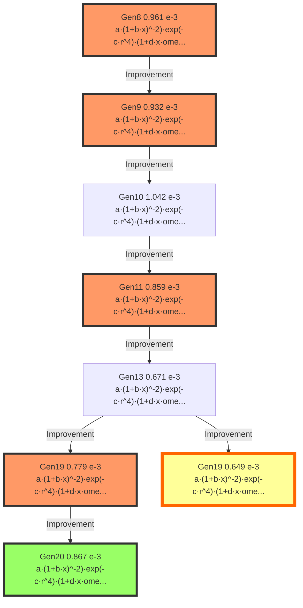

# Model Evolution Lineage

## Evolution Path from Generation 8 to 20

This document traces the evolutionary path of the champion model,
showing how the mathematical structure evolved across generations.

## Evolution Graph

The following diagram shows the lineage from Generation 8 (origin) to Generation 20 (final best model).

**Edge types** indicate the evolution strategy:
- Solid arrow (→): Improvement (EP2)
- Dashed arrow (-→): Simplification (EP4)
- Bold arrow (⇒): Physics Fix (EP3)
- Wavy arrow (~→): New Structure (EP1)

**Node colors:**
- 🟨 Gold node: Global Best Model (Lowest Score)
- 🟩 Green node: Final Best Model (Gen 20)
- 🟥 Pink nodes: Key milestones
- ⬜ White nodes: Intermediate generations




## Model Formulas

| Generation | Score (×10⁻³) | Formula | Coefficients |
|------------|---------------|---------|--------------|
| Gen8 | 0.961 | $a \cdot (1 + b \cdot x)^{-2} \cdot exp(-c \cdot r^4) \cdot (1 + d \cdot x \cdot omega) \cdot (1 + e \cdot nut)$ | `[60.1286, -79.3290, 3.7697, -52.5536, -56.8661]` |
| Gen9 | 0.932 | $a \cdot (1 + b \cdot x)^{-2} \cdot exp(-c \cdot r^4) \cdot (1 + d \cdot x \cdot omega) \cdot (1 + e \cdot nut)$ | `[40.0205, -86.4605, 3.4666, -46.9281, -89.9078]` |
| Gen10 | 1.042 | $a \cdot (1 + b \cdot x)^{-2} \cdot exp(-c \cdot r^4) \cdot (1 + d \cdot x \cdot omega) \cdot (1 + e \cdot nut)$ | `[9.3286, 80.4396, 5.1151, 78.0317, 71.1611]` |
| Gen11 | 0.859 | $a \cdot (1 + b \cdot x)^{-2} \cdot exp(-c \cdot r^4) \cdot (1 + d \cdot x \cdot omega) \cdot (1 + e \cdot nut) \cdot (1 + f \cdot k)$ | `[62.2233, -78.3030, 12.5246, -65.6092, -84.0534, -13.9759]` |
| Gen13 | 0.671 | $a \cdot (1 + b \cdot x)^{-2} \cdot exp(-c \cdot r^4) \cdot (1 + d \cdot x \cdot omega) \cdot (1 + e \cdot nut) \cdot (1 + f \cdot k)$ | `[81.4480, -82.9358, 7.7114, 97.4989, 16.4702, -15.4063]` |
| Gen19 | 0.779 | $a \cdot (1 + b \cdot x)^{-2} \cdot exp(-c \cdot r^4) \cdot (1 + d \cdot x \cdot omega) \cdot (1 + e \cdot nut) \cdot (1 + f \cdot k)$ | `[5.2385, 27.0532, 4.4199, 61.4113, 41.4793, -14.8961]` |
| Gen19 | 0.649 | $a \cdot (1 + b \cdot x)^{-2} \cdot exp(-c \cdot r^4) \cdot (1 + d \cdot x \cdot omega) \cdot (1 + e \cdot nut) \cdot (1 + f \cdot k)$ | `[94.4334, -46.4271, 8.1368, 16.9789, 49.7661, -16.5496]` |
| Gen20 | 0.867 | $a \cdot (1 + b \cdot x)^{-2} \cdot exp(-c \cdot r^4) \cdot (1 + d \cdot x \cdot omega) \cdot (1 + e \cdot nut) \cdot (1 + f \cdot k)$ | `[45.0291, 43.2654, 11.4575, -29.0389, -77.3908, -12.1908]` |

## Major Milestones

### Generation 1: Initial exploration

**Strategy**: EP1

**Score**: 0.00096126

**Formula**:
```
a * (1 + b*x)^(-2) * exp(-c*r^4) * (1 + d*x*omega) * (1 + e*nut)
```

**Reasoning**: EP1: Super-Gaussian radial profile with Omega/Nut

### Generation 3: Simplified structure

**Strategy**: EP2

**Score**: 0.00104191

**Formula**:
```
a * (1 + b*x)^(-2) * exp(-c*r^4) * (1 + d*x*omega) * (1 + e*nut)
```

**Reasoning**: EP2: Final refinement of Gen 9 ID 1 (Best Model)

### Generation 6: TKE term refinement

**Strategy**: EP2

**Score**: 0.00077913

**Formula**:
```
a * (1 + b*x)^(-2) * exp(-c*r^4) * (1 + d*x*omega) * (1 + e*nut) * (1 + f*k)
```

**Reasoning**: EP2: Massive Exploitation of Gen 13 ID 1 structure - Attempt 6

### Generation 8: Near-wake correction added

**Strategy**: EP2

**Score**: 0.00086675

**Formula**:
```
a * (1 + b*x)^(-2) * exp(-c*r^4) * (1 + d*x*omega) * (1 + e*nut) * (1 + f*k)
```

**Reasoning**: EP2: Final Massive Exploitation of Gen 13 ID 1 structure - Attempt 14

## Complete Evolution History

### Generation 8

- **Strategy**: EP1
- **Score**: 0.00096126

**Formula**:
```
a * (1 + b*x)^(-2) * exp(-c*r^4) * (1 + d*x*omega) * (1 + e*nut)
```

_EP1: Super-Gaussian radial profile with Omega/Nut_

---

### Generation 9

- **Strategy**: EP2
- **Score**: 0.00093221 (↓ 3.02%)

**Formula**:
```
a * (1 + b*x)^(-2) * exp(-c*r^4) * (1 + d*x*omega) * (1 + e*nut)
```

_EP2: Re-evaluating Gen 8 ID 4 (New Best) with fresh optimization_

---

### Generation 10

- **Strategy**: EP2
- **Score**: 0.00104191 (↑ 11.77%)

**Formula**:
```
a * (1 + b*x)^(-2) * exp(-c*r^4) * (1 + d*x*omega) * (1 + e*nut)
```

_EP2: Final refinement of Gen 9 ID 1 (Best Model)_

---

### Generation 11

- **Strategy**: EP2
- **Score**: 0.00085897 (↓ 17.56%)

**Formula**:
```
a * (1 + b*x)^(-2) * exp(-c*r^4) * (1 + d*x*omega) * (1 + e*nut) * (1 + f*k)
```

_EP2: Improved Gen 10 ID 1 with TKE term_

---

### Generation 13

- **Strategy**: EP2
- **Score**: 0.00067093 (↓ 21.89%)

**Formula**:
```
a * (1 + b*x)^(-2) * exp(-c*r^4) * (1 + d*x*omega) * (1 + e*nut) * (1 + f*k)
```

_EP2: Re-evaluating Gen 11 ID 4 (Champion) with fresh optimization_

---

### Generation 19

- **Strategy**: EP2
- **Score**: 0.00077913 (↑ 16.13%)

**Formula**:
```
a * (1 + b*x)^(-2) * exp(-c*r^4) * (1 + d*x*omega) * (1 + e*nut) * (1 + f*k)
```

_EP2: Massive Exploitation of Gen 13 ID 1 structure - Attempt 6_

---

### Generation 19

- **Strategy**: EP2
- **Score**: 0.00064916 (↓ 16.68%)

**Formula**:
```
a * (1 + b*x)^(-2) * exp(-c*r^4) * (1 + d*x*omega) * (1 + e*nut) * (1 + f*k)
```

_EP2: Massive Exploitation of Gen 13 ID 1 structure - Attempt 4_

---

### Generation 20

- **Strategy**: EP2
- **Score**: 0.00086675 (↑ 33.52%)

**Formula**:
```
a * (1 + b*x)^(-2) * exp(-c*r^4) * (1 + d*x*omega) * (1 + e*nut) * (1 + f*k)
```

_EP2: Final Massive Exploitation of Gen 13 ID 1 structure - Attempt 14_

---

## Evolution Summary Table

| Gen | Strategy | Score | Key Change |
|-----|----------|-------|------------|
|  8 | EP1 | 0.000961 |  |
|  9 | EP2 | 0.000932 |  |
| 10 | EP2 | 0.001042 |  |
| 11 | EP2 | 0.000859 |  |
| 13 | EP2 | 0.000671 |  |
| 19 | EP2 | 0.000779 |  |
| 19 | EP2 | 0.000649 |  |
| 20 | EP2 | 0.000867 |  |

## Statistical Summary

- **Initial Score (Gen 1)**: 0.00096126
- **Final Score (Gen 8)**: 0.00086675
- **Total Improvement**: 9.83%
- **Best Score**: 0.00064916 (Gen 7)

