# Model Evolution Lineage

## Evolution Path from Generation 1 to 20

This document traces the evolutionary path of the champion model,
showing how the mathematical structure evolved across generations.

## Evolution Graph

The following diagram shows the lineage from Generation 1 (origin) to Generation 20 (final best model).

**Edge types** indicate the evolution strategy:
- Solid arrow (→): Improvement (EP2)
- Dashed arrow (-→): Simplification (EP4)
- Bold arrow (⇒): Physics Fix (EP3)
- Wavy arrow (~→): New Structure (EP1)

**Node colors:**
- 🟨 Gold node: Global Best Model (Lowest Score)
- 🟩 Green node: Final Best Model (Gen 20)
- 🟥 Pink nodes: Key milestones
- ⬜ White nodes: Intermediate generations

```mermaid
flowchart TD
    G1_20["Gen1 0.742 e-3<br/>a·x^(-1)·exp(-b·r^2)"]
    G1_18["Gen1 1.488 e-3<br/>a·x^(-1/3)·exp(-b·r^2)"]
    G2_2["Gen2 0.836 e-3<br/>a·x^(-1)·exp(-b·r^2)"]
    G2_11["Gen2 0.995 e-3<br/>a·x^(-1/3)·exp(-b·r^2)"]
    G3_7["Gen3 0.530 e-3<br/>a·x^(-1)·exp(-b·r^2)"]
    G3_14["Gen3 0.499 e-3<br/>a·x^(-1/3)·exp(-b·r^2)"]
    G4_7["Gen4 0.663 e-3<br/>a·x^(-1)·exp(-b·r^2)"]
    G5_10["Gen5 0.666 e-3<br/>a·x^(-1)·exp(-b·r^2)"]
    G6_10["Gen6 0.594 e-3<br/>a·x^(-1)·exp(-b·r^2)"]
    G7_11["Gen7 0.519 e-3<br/>a·x^(-1)·exp(-b·r^2)"]
    G8_2["Gen8 0.539 e-3<br/>a·x^(-1)·exp(-b·r^2)"]
    G9_7["Gen9 0.532 e-3<br/>a·x^(-1)·exp(-b·r^2)"]
    G10_1["Gen10 0.520 e-3<br/>a·x^(-1)·exp(-b·r^2)"]
    G11_2["Gen11 0.543 e-3<br/>a·x^(-1)·exp(-b·r^2)"]
    G12_7["Gen12 0.579 e-3<br/>a·x^(-1)·exp(-b·r^2)"]
    G13_7["Gen13 0.529 e-3<br/>a·x^(-1)·exp(-b·r^2)"]
    G14_1["Gen14 0.597 e-3<br/>a·x^(-1)·exp(-b·r^2)"]
    G15_5["Gen15 0.531 e-3<br/>a·x^(-1)·exp(-b·r^2)"]
    G16_5["Gen16 0.531 e-3<br/>a·x^(-1)·exp(-b·r^2)"]
    G17_1["Gen17 0.559 e-3<br/>a·x^(-1)·exp(-b·r^2)"]
    G18_8["Gen18 0.602 e-3<br/>a·x^(-1)·exp(-b·r^2)"]
    G19_10["Gen19 0.626 e-3<br/>a·x^(-1)·exp(-b·r^2)"]
    G20_7["Gen20 0.549 e-3<br/>a·x^(-1)·exp(-b·r^2)"]

    G1_20 --> |Improvement| G2_2
    G1_18 --> |Improvement| G2_11
    G2_2 --> |Improvement| G3_7
    G2_11 --> |Improvement| G3_14
    G3_7 --> |Improvement| G4_7
    G4_7 --> |Improvement| G5_10
    G5_10 --> |Improvement| G6_10
    G6_10 --> |Improvement| G7_11
    G7_11 --> |Improvement| G8_2
    G8_2 --> |Improvement| G9_7
    G9_7 --> |Improvement| G10_1
    G10_1 --> |Improvement| G11_2
    G11_2 --> |Improvement| G12_7
    G12_7 --> |Improvement| G13_7
    G13_7 --> |Improvement| G14_1
    G14_1 --> |Improvement| G15_5
    G15_5 --> |Improvement| G16_5
    G16_5 --> |Improvement| G17_1
    G17_1 --> |Improvement| G18_8
    G18_8 --> |Improvement| G19_10
    G19_10 --> |Improvement| G20_7

    classDef milestone fill:#f96,stroke:#333,stroke-width:4px
    classDef final fill:#9f6,stroke:#333,stroke-width:4px
    classDef globalBest fill:#ff9,stroke:#f60,stroke-width:6px
    class G1_20 milestone
    class G3_7 milestone
    class G8_2 milestone
    class G12_7 milestone
    class G20_7 final
    class G3_14 globalBest
```




## Model Formulas

| Generation | Score (×10⁻³) | Formula | Coefficients |
|------------|---------------|---------|--------------|
| Gen1 | 0.742 | $a \cdot x^{-1} \cdot exp(-b \cdot r^2)$ | `[1.0317, 3.9250]` |
| Gen1 | 1.488 | $a \cdot x^(-1/3) \cdot exp(-b \cdot r^2)$ | `[0.2127, 28.4748]` |
| Gen2 | 0.836 | $a \cdot x^{-1} \cdot exp(-b \cdot r^2)$ | `[1.0402, 7.1863]` |
| Gen2 | 0.995 | $a \cdot x^(-1/3) \cdot exp(-b \cdot r^2)$ | `[0.3897, 9.6578]` |
| Gen3 | 0.530 | $a \cdot x^{-1} \cdot exp(-b \cdot r^2)$ | `[0.8034, 1.6354]` |
| Gen3 | 0.499 | $a \cdot x^(-1/3) \cdot exp(-b \cdot r^2)$ | `[0.2286, 0.6543]` |
| Gen4 | 0.663 | $a \cdot x^{-1} \cdot exp(-b \cdot r^2)$ | `[0.9587, 4.1185]` |
| Gen5 | 0.666 | $a \cdot x^{-1} \cdot exp(-b \cdot r^2)$ | `[0.8151, 4.2317]` |
| Gen6 | 0.594 | $a \cdot x^{-1} \cdot exp(-b \cdot r^2)$ | `[0.7326, 2.9677]` |
| Gen7 | 0.519 | $a \cdot x^{-1} \cdot exp(-b \cdot r^2)$ | `[0.7281, 1.6949]` |
| Gen8 | 0.539 | $a \cdot x^{-1} \cdot exp(-b \cdot r^2)$ | `[0.6628, 1.2314]` |
| Gen9 | 0.532 | $a \cdot x^{-1} \cdot exp(-b \cdot r^2)$ | `[0.7987, 2.1889]` |
| Gen10 | 0.520 | $a \cdot x^{-1} \cdot exp(-b \cdot r^2)$ | `[0.7562, 1.6092]` |
| Gen11 | 0.543 | $a \cdot x^{-1} \cdot exp(-b \cdot r^2)$ | `[0.7702, 2.3843]` |
| Gen12 | 0.579 | $a \cdot x^{-1} \cdot exp(-b \cdot r^2)$ | `[0.8973, 1.6646]` |
| Gen13 | 0.529 | $a \cdot x^{-1} \cdot exp(-b \cdot r^2)$ | `[0.7797, 1.5228]` |
| Gen14 | 0.597 | $a \cdot x^{-1} \cdot exp(-b \cdot r^2)$ | `[0.5527, 0.9836]` |
| Gen15 | 0.531 | $a \cdot x^{-1} \cdot exp(-b \cdot r^2)$ | `[0.8141, 1.6824]` |
| Gen16 | 0.531 | $a \cdot x^{-1} \cdot exp(-b \cdot r^2)$ | `[0.8212, 1.7660]` |
| Gen17 | 0.559 | $a \cdot x^{-1} \cdot exp(-b \cdot r^2)$ | `[0.7888, 2.6655]` |
| Gen18 | 0.602 | $a \cdot x^{-1} \cdot exp(-b \cdot r^2)$ | `[0.9304, 3.1586]` |
| Gen19 | 0.626 | $a \cdot x^{-1} \cdot exp(-b \cdot r^2)$ | `[0.8769, 3.7141]` |
| Gen20 | 0.549 | $a \cdot x^{-1} \cdot exp(-b \cdot r^2)$ | `[0.8508, 2.4591]` |

## Major Milestones

### Generation 1: Initial exploration

**Strategy**: FixedPower

**Score**: 0.00074244

**Formula**:
```
a * x^(-1) * exp(-b*r^2)
```

**Reasoning**: Fixed power law -1.

### Generation 3: Simplified structure

**Strategy**: Mutation

**Score**: 0.00083605

**Formula**:
```
a * x^(-1) * exp(-b*r^2)
```

**Reasoning**: Adjusted exponents (x/terms) to fine-tune decay. P1/P3 optimization.

### Generation 6: TKE term refinement

**Strategy**: Mutation

**Score**: 0.00049928

**Formula**:
```
a * x^(-1/3) * exp(-b*r^2)
```

**Reasoning**: Adjusted exponents (x/terms) to fine-tune decay. P1/P3 optimization.

### Generation 8: Near-wake correction added

**Strategy**: Elitism

**Score**: 0.00066634

**Formula**:
```
a * x^(-1) * exp(-b*r^2)
```

**Reasoning**: Retaining high performance model: Retaining high performance model: Retaining high performance model: Adjusted exponents (x/terms) to fine-tune decay. P1/P3 optimization.

### Generation 10: Removal of near-wake term

**Strategy**: Mutation

**Score**: 0.0005186

**Formula**:
```
a * x^(-1) * exp(-b*r^2)
```

**Reasoning**: Adjusted exponents (x/terms) to fine-tune decay. P1/P3 optimization.

### Generation 11: Re-addition of near-wake term

**Strategy**: Mutation

**Score**: 0.00053891

**Formula**:
```
a * x^(-1) * exp(-b*r^2)
```

**Reasoning**: Adjusted exponents (x/terms) to fine-tune decay. P1/P3 optimization.

### Generation 13: TKE power optimization

**Strategy**: Elitism

**Score**: 0.00052007

**Formula**:
```
a * x^(-1) * exp(-b*r^2)
```

**Reasoning**: Retaining high performance model: Retaining high performance model: Adjusted exponents (x/terms) to fine-tune decay. P1/P3 optimization.

### Generation 17: Decay rate fine-tuning

**Strategy**: Elitism

**Score**: 0.00059659

**Formula**:
```
a * x^(-1) * exp(-b*r^2)
```

**Reasoning**: Retaining high performance model: Retaining high performance model: Retaining high performance model: Adjusted exponents (x/terms) to fine-tune decay. P1/P3 optimization.

### Generation 20: Final convergence

**Strategy**: Elitism

**Score**: 0.00055863

**Formula**:
```
a * x^(-1) * exp(-b*r^2)
```

**Reasoning**: Retaining high performance model: Adjusted exponents (x/terms) to fine-tune decay. P1/P3 optimization.

## Complete Evolution History

### Generation 1

- **Strategy**: FixedPower
- **Score**: 0.00074244

**Formula**:
```
a * x^(-1) * exp(-b*r^2)
```

_Fixed power law -1._

---

### Generation 1

- **Strategy**: FixedPower
- **Score**: 0.00148812 (↑ 100.44%)

**Formula**:
```
a * x^(-1/3) * exp(-b*r^2)
```

_Fixed power law -1/3._

---

### Generation 2

- **Strategy**: Mutation
- **Score**: 0.00083605 (↓ 43.82%)

**Formula**:
```
a * x^(-1) * exp(-b*r^2)
```

_Adjusted exponents (x/terms) to fine-tune decay. P1/P3 optimization._

---

### Generation 2

- **Strategy**: Mutation
- **Score**: 0.00099467 (↑ 18.97%)

**Formula**:
```
a * x^(-1/3) * exp(-b*r^2)
```

_Adjusted exponents (x/terms) to fine-tune decay. P1/P3 optimization._

---

### Generation 3

- **Strategy**: Elitism
- **Score**: 0.00052969 (↓ 46.75%)

**Formula**:
```
a * x^(-1) * exp(-b*r^2)
```

_Retaining high performance model: Adjusted exponents (x/terms) to fine-tune decay. P1/P3 optimization._

---

### Generation 3

- **Strategy**: Mutation
- **Score**: 0.00049928 (↓ 5.74%)

**Formula**:
```
a * x^(-1/3) * exp(-b*r^2)
```

_Adjusted exponents (x/terms) to fine-tune decay. P1/P3 optimization._

---

### Generation 4

- **Strategy**: Elitism
- **Score**: 0.00066321 (↑ 32.83%)

**Formula**:
```
a * x^(-1) * exp(-b*r^2)
```

_Retaining high performance model: Retaining high performance model: Adjusted exponents (x/terms) to fine-tune decay. P1/P3 optimization._

---

### Generation 5

- **Strategy**: Elitism
- **Score**: 0.00066634 (↑ 0.47%)

**Formula**:
```
a * x^(-1) * exp(-b*r^2)
```

_Retaining high performance model: Retaining high performance model: Retaining high performance model: Adjusted exponents (x/terms) to fine-tune decay. P1/P3 optimization._

---

### Generation 6

- **Strategy**: Elitism
- **Score**: 0.00059433 (↓ 10.81%)

**Formula**:
```
a * x^(-1) * exp(-b*r^2)
```

_Retaining high performance model: Retaining high performance model: Retaining high performance model: Retaining high performance model: Adjusted exponents (x/terms) to fine-tune decay. P1/P3 optimization._

---

### Generation 7

- **Strategy**: Mutation
- **Score**: 0.0005186 (↓ 12.74%)

**Formula**:
```
a * x^(-1) * exp(-b*r^2)
```

_Adjusted exponents (x/terms) to fine-tune decay. P1/P3 optimization._

---

### Generation 8

- **Strategy**: Mutation
- **Score**: 0.00053891 (↑ 3.92%)

**Formula**:
```
a * x^(-1) * exp(-b*r^2)
```

_Adjusted exponents (x/terms) to fine-tune decay. P1/P3 optimization._

---

### Generation 9

- **Strategy**: Elitism
- **Score**: 0.00053154 (↓ 1.37%)

**Formula**:
```
a * x^(-1) * exp(-b*r^2)
```

_Retaining high performance model: Adjusted exponents (x/terms) to fine-tune decay. P1/P3 optimization._

---

### Generation 10

- **Strategy**: Elitism
- **Score**: 0.00052007 (↓ 2.16%)

**Formula**:
```
a * x^(-1) * exp(-b*r^2)
```

_Retaining high performance model: Retaining high performance model: Adjusted exponents (x/terms) to fine-tune decay. P1/P3 optimization._

---

### Generation 11

- **Strategy**: Mutation
- **Score**: 0.00054265 (↑ 4.34%)

**Formula**:
```
a * x^(-1) * exp(-b*r^2)
```

_Adjusted exponents (x/terms) to fine-tune decay. P1/P3 optimization._

---

### Generation 12

- **Strategy**: Elitism
- **Score**: 0.0005785 (↑ 6.61%)

**Formula**:
```
a * x^(-1) * exp(-b*r^2)
```

_Retaining high performance model: Adjusted exponents (x/terms) to fine-tune decay. P1/P3 optimization._

---

### Generation 13

- **Strategy**: Elitism
- **Score**: 0.00052876 (↓ 8.6%)

**Formula**:
```
a * x^(-1) * exp(-b*r^2)
```

_Retaining high performance model: Retaining high performance model: Adjusted exponents (x/terms) to fine-tune decay. P1/P3 optimization._

---

### Generation 14

- **Strategy**: Elitism
- **Score**: 0.00059659 (↑ 12.83%)

**Formula**:
```
a * x^(-1) * exp(-b*r^2)
```

_Retaining high performance model: Retaining high performance model: Retaining high performance model: Adjusted exponents (x/terms) to fine-tune decay. P1/P3 optimization._

---

### Generation 15

- **Strategy**: Mutation
- **Score**: 0.00053118 (↓ 10.96%)

**Formula**:
```
a * x^(-1) * exp(-b*r^2)
```

_Adjusted exponents (x/terms) to fine-tune decay. P1/P3 optimization._

---

### Generation 16

- **Strategy**: Mutation
- **Score**: 0.00053067 (↓ 0.1%)

**Formula**:
```
a * x^(-1) * exp(-b*r^2)
```

_Adjusted exponents (x/terms) to fine-tune decay. P1/P3 optimization._

---

### Generation 17

- **Strategy**: Elitism
- **Score**: 0.00055863 (↑ 5.27%)

**Formula**:
```
a * x^(-1) * exp(-b*r^2)
```

_Retaining high performance model: Adjusted exponents (x/terms) to fine-tune decay. P1/P3 optimization._

---

### Generation 18

- **Strategy**: Mutation
- **Score**: 0.0006023 (↑ 7.82%)

**Formula**:
```
a * x^(-1) * exp(-b*r^2)
```

_Adjusted exponents (x/terms) to fine-tune decay. P1/P3 optimization._

---

### Generation 19

- **Strategy**: Elitism
- **Score**: 0.00062645 (↑ 4.01%)

**Formula**:
```
a * x^(-1) * exp(-b*r^2)
```

_Retaining high performance model: Adjusted exponents (x/terms) to fine-tune decay. P1/P3 optimization._

---

### Generation 20

- **Strategy**: Elitism
- **Score**: 0.00054904 (↓ 12.36%)

**Formula**:
```
a * x^(-1) * exp(-b*r^2)
```

_Retaining high performance model: Retaining high performance model: Adjusted exponents (x/terms) to fine-tune decay. P1/P3 optimization._

---

## Evolution Summary Table

| Gen | Strategy | Score | Key Change |
|-----|----------|-------|------------|
|  1 | FixedPower | 0.000742 |  |
|  1 | FixedPower | 0.001488 |  |
|  2 | Mutation | 0.000836 |  |
|  2 | Mutation | 0.000995 |  |
|  3 | Elitism | 0.000530 |  |
|  3 | Mutation | 0.000499 |  |
|  4 | Elitism | 0.000663 |  |
|  5 | Elitism | 0.000666 |  |
|  6 | Elitism | 0.000594 |  |
|  7 | Mutation | 0.000519 |  |
|  8 | Mutation | 0.000539 |  |
|  9 | Elitism | 0.000532 |  |
| 10 | Elitism | 0.000520 |  |
| 11 | Mutation | 0.000543 |  |
| 12 | Elitism | 0.000579 |  |
| 13 | Elitism | 0.000529 |  |
| 14 | Elitism | 0.000597 |  |
| 15 | Mutation | 0.000531 |  |
| 16 | Mutation | 0.000531 |  |
| 17 | Elitism | 0.000559 |  |
| 18 | Mutation | 0.000602 |  |
| 19 | Elitism | 0.000626 |  |
| 20 | Elitism | 0.000549 |  |

## Statistical Summary

- **Initial Score (Gen 1)**: 0.00074244
- **Final Score (Gen 23)**: 0.00054904
- **Total Improvement**: 26.05%
- **Best Score**: 0.00049928 (Gen 6)

