# Model Evolution Lineage

## Evolution Path from Generation 1 to 20

This document traces the evolutionary path of the champion model,
showing how the mathematical structure evolved across generations.

## Evolution Graph

The following diagram shows the lineage from Generation 1 (origin) to Generation 20 (final best model).

**Edge types** indicate the evolution strategy:
- Solid arrow (→): Improvement (EP2)
- Dashed arrow (-→): Simplification (EP4)
- Bold arrow (⇒): Physics Fix (EP3)
- Wavy arrow (~→): New Structure (EP1)

**Node colors:**
- 🟨 Gold node: Global Best Model (Lowest Score)
- 🟩 Green node: Final Best Model (Gen 20)
- 🟥 Pink nodes: Key milestones
- ⬜ White nodes: Intermediate generations

```mermaid
flowchart TD
    G1_20["Gen1 0.568 e-3<br/>a·x^(-1)·exp(-b·r^2)"]
    G2_5["Gen2 0.631 e-3<br/>a·x^(-1)·exp(-b·r^2)"]
    G3_4["Gen3 0.716 e-3<br/>a·x^(-1)·exp(-b·r^2)"]
    G4_11["Gen4 0.544 e-3<br/>a·x^(-1)·exp(-b·r^2)"]
    G5_8["Gen5 0.560 e-3<br/>a·x^(-1)·exp(-b·r^2)"]
    G6_7["Gen6 0.547 e-3<br/>a·x^(-1)·exp(-b·r^2)"]
    G7_1["Gen7 0.554 e-3<br/>a·x^(-1)·exp(-b·r^2)"]
    G8_10["Gen8 0.568 e-3<br/>a·x^(-1)·exp(-b·r^2)"]
    G9_7["Gen9 0.534 e-3<br/>a·x^(-1)·exp(-b·r^2)"]
    G10_5["Gen10 0.615 e-3<br/>a·x^(-1)·exp(-b·r^2)"]
    G11_13["Gen11 0.546 e-3<br/>a·x^(-1)·exp(-b·r^2)"]
    G12_5["Gen12 0.592 e-3<br/>a·x^(-1)·exp(-b·r^2)"]
    G13_14["Gen13 0.649 e-3<br/>a·x^(-1)·exp(-b·r^2)"]
    G14_14["Gen14 0.653 e-3<br/>a·x^(-1)·exp(-b·r^2)"]
    G15_14["Gen15 0.584 e-3<br/>a·x^(-1)·exp(-b·r^2)"]
    G16_11["Gen16 0.680 e-3<br/>a·x^(-1)·exp(-b·r^2)"]
    G17_7["Gen17 0.556 e-3<br/>a·x^(-1)·exp(-b·r^2)"]
    G18_14["Gen18 0.533 e-3<br/>a·x^(-1)·exp(-b·r^2)"]
    G19_4["Gen19 0.553 e-3<br/>a·x^(-1)·exp(-b·r^2)"]
    G20_5["Gen20 0.520 e-3<br/>a·x^(-1)·exp(-b·r^2)"]

    G1_20 --> |Improvement| G2_5
    G2_5 --> |Improvement| G3_4
    G3_4 --> |Improvement| G4_11
    G4_11 --> |Improvement| G5_8
    G5_8 --> |Improvement| G6_7
    G6_7 --> |Improvement| G7_1
    G7_1 --> |Improvement| G8_10
    G8_10 --> |Improvement| G9_7
    G9_7 --> |Improvement| G10_5
    G10_5 --> |Improvement| G11_13
    G11_13 --> |Improvement| G12_5
    G12_5 --> |Improvement| G13_14
    G13_14 --> |Improvement| G14_14
    G14_14 --> |Improvement| G15_14
    G15_14 --> |Improvement| G16_11
    G16_11 --> |Improvement| G17_7
    G17_7 --> |Improvement| G18_14
    G18_14 --> |Improvement| G19_4
    G19_4 --> |Improvement| G20_5

    classDef milestone fill:#f96,stroke:#333,stroke-width:4px
    classDef final fill:#9f6,stroke:#333,stroke-width:4px
    classDef globalBest fill:#ff9,stroke:#f60,stroke-width:6px
    class G1_20 milestone
    class G5_8 milestone
    class G10_5 milestone
    class G15_14 milestone
    class G20_5 globalBest
```




## Model Formulas

| Generation | Score (×10⁻³) | Formula | Coefficients |
|------------|---------------|---------|--------------|
| Gen1 | 0.568 | $a \cdot x^{-1} \cdot exp(-b \cdot r^2)$ | `[0.7608, 1.6184]` |
| Gen2 | 0.631 | $a \cdot x^{-1} \cdot exp(-b \cdot r^2)$ | `[0.9514, 1.6353]` |
| Gen3 | 0.716 | $a \cdot x^{-1} \cdot exp(-b \cdot r^2)$ | `[0.8013, 4.9214]` |
| Gen4 | 0.544 | $a \cdot x^{-1} \cdot exp(-b \cdot r^2)$ | `[0.8201, 2.4408]` |
| Gen5 | 0.560 | $a \cdot x^{-1} \cdot exp(-b \cdot r^2)$ | `[0.5875, 1.3173]` |
| Gen6 | 0.547 | $a \cdot x^{-1} \cdot exp(-b \cdot r^2)$ | `[0.7039, 1.1838]` |
| Gen7 | 0.554 | $a \cdot x^{-1} \cdot exp(-b \cdot r^2)$ | `[0.7606, 2.5380]` |
| Gen8 | 0.568 | $a \cdot x^{-1} \cdot exp(-b \cdot r^2)$ | `[0.8757, 2.7636]` |
| Gen9 | 0.534 | $a \cdot x^{-1} \cdot exp(-b \cdot r^2)$ | `[0.8324, 2.1375]` |
| Gen10 | 0.615 | $a \cdot x^{-1} \cdot exp(-b \cdot r^2)$ | `[0.9911, 2.2733]` |
| Gen11 | 0.546 | $a \cdot x^{-1} \cdot exp(-b \cdot r^2)$ | `[0.8707, 2.2073]` |
| Gen12 | 0.592 | $a \cdot x^{-1} \cdot exp(-b \cdot r^2)$ | `[0.9480, 2.7731]` |
| Gen13 | 0.649 | $a \cdot x^{-1} \cdot exp(-b \cdot r^2)$ | `[1.0392, 2.7525]` |
| Gen14 | 0.653 | $a \cdot x^{-1} \cdot exp(-b \cdot r^2)$ | `[0.7381, 3.7359]` |
| Gen15 | 0.584 | $a \cdot x^{-1} \cdot exp(-b \cdot r^2)$ | `[0.6208, 2.1395]` |
| Gen16 | 0.680 | $a \cdot x^{-1} \cdot exp(-b \cdot r^2)$ | `[0.7856, 0.9243]` |
| Gen17 | 0.556 | $a \cdot x^{-1} \cdot exp(-b \cdot r^2)$ | `[0.8806, 2.4645]` |
| Gen18 | 0.533 | $a \cdot x^{-1} \cdot exp(-b \cdot r^2)$ | `[0.7417, 1.3526]` |
| Gen19 | 0.553 | $a \cdot x^{-1} \cdot exp(-b \cdot r^2)$ | `[0.6175, 1.1615]` |
| Gen20 | 0.520 | $a \cdot x^{-1} \cdot exp(-b \cdot r^2)$ | `[0.7584, 1.8569]` |

## Major Milestones

### Generation 1: Initial exploration

**Strategy**: FixedPower

**Score**: 0.00056772

**Formula**:
```
a * x^(-1) * exp(-b*r^2)
```

**Reasoning**: Fixed power law -1.

### Generation 3: Simplified structure

**Strategy**: Elitism

**Score**: 0.00071559

**Formula**:
```
a * x^(-1) * exp(-b*r^2)
```

**Reasoning**: Retaining high performance model: Adjusted exponents (x/terms) to fine-tune decay. P1/P3 optimization.

### Generation 6: TKE term refinement

**Strategy**: Elitism

**Score**: 0.00054659

**Formula**:
```
a * x^(-1) * exp(-b*r^2)
```

**Reasoning**: Retaining high performance model: Adjusted exponents (x/terms) to fine-tune decay. P1/P3 optimization.

### Generation 8: Near-wake correction added

**Strategy**: Elitism

**Score**: 0.00056829

**Formula**:
```
a * x^(-1) * exp(-b*r^2)
```

**Reasoning**: Retaining high performance model: Retaining high performance model: Retaining high performance model: Adjusted exponents (x/terms) to fine-tune decay. P1/P3 optimization.

### Generation 10: Removal of near-wake term

**Strategy**: Mutation

**Score**: 0.00061532

**Formula**:
```
a * x^(-1) * exp(-b*r^2)
```

**Reasoning**: Adjusted exponents (x/terms) to fine-tune decay. P1/P3 optimization.

### Generation 11: Re-addition of near-wake term

**Strategy**: Elitism

**Score**: 0.00054628

**Formula**:
```
a * x^(-1) * exp(-b*r^2)
```

**Reasoning**: Retaining high performance model: Adjusted exponents (x/terms) to fine-tune decay. P1/P3 optimization.

### Generation 13: TKE power optimization

**Strategy**: Mutation

**Score**: 0.00064936

**Formula**:
```
a * x^(-1) * exp(-b*r^2)
```

**Reasoning**: Adjusted exponents (x/terms) to fine-tune decay. P1/P3 optimization.

### Generation 17: Decay rate fine-tuning

**Strategy**: Elitism

**Score**: 0.00055628

**Formula**:
```
a * x^(-1) * exp(-b*r^2)
```

**Reasoning**: Retaining high performance model: Adjusted exponents (x/terms) to fine-tune decay. P1/P3 optimization.

### Generation 20: Final convergence

**Strategy**: Mutation

**Score**: 0.00051999

**Formula**:
```
a * x^(-1) * exp(-b*r^2)
```

**Reasoning**: Adjusted exponents (x/terms) to fine-tune decay. P1/P3 optimization.

## Complete Evolution History

### Generation 1

- **Strategy**: FixedPower
- **Score**: 0.00056772

**Formula**:
```
a * x^(-1) * exp(-b*r^2)
```

_Fixed power law -1._

---

### Generation 2

- **Strategy**: Mutation
- **Score**: 0.00063086 (↑ 11.12%)

**Formula**:
```
a * x^(-1) * exp(-b*r^2)
```

_Adjusted exponents (x/terms) to fine-tune decay. P1/P3 optimization._

---

### Generation 3

- **Strategy**: Elitism
- **Score**: 0.00071559 (↑ 13.43%)

**Formula**:
```
a * x^(-1) * exp(-b*r^2)
```

_Retaining high performance model: Adjusted exponents (x/terms) to fine-tune decay. P1/P3 optimization._

---

### Generation 4

- **Strategy**: Mutation
- **Score**: 0.00054445 (↓ 23.92%)

**Formula**:
```
a * x^(-1) * exp(-b*r^2)
```

_Adjusted exponents (x/terms) to fine-tune decay. P1/P3 optimization._

---

### Generation 5

- **Strategy**: Mutation
- **Score**: 0.00056003 (↑ 2.86%)

**Formula**:
```
a * x^(-1) * exp(-b*r^2)
```

_Adjusted exponents (x/terms) to fine-tune decay. P1/P3 optimization._

---

### Generation 6

- **Strategy**: Elitism
- **Score**: 0.00054659 (↓ 2.4%)

**Formula**:
```
a * x^(-1) * exp(-b*r^2)
```

_Retaining high performance model: Adjusted exponents (x/terms) to fine-tune decay. P1/P3 optimization._

---

### Generation 7

- **Strategy**: Elitism
- **Score**: 0.00055418 (↑ 1.39%)

**Formula**:
```
a * x^(-1) * exp(-b*r^2)
```

_Retaining high performance model: Retaining high performance model: Adjusted exponents (x/terms) to fine-tune decay. P1/P3 optimization._

---

### Generation 8

- **Strategy**: Elitism
- **Score**: 0.00056829 (↑ 2.55%)

**Formula**:
```
a * x^(-1) * exp(-b*r^2)
```

_Retaining high performance model: Retaining high performance model: Retaining high performance model: Adjusted exponents (x/terms) to fine-tune decay. P1/P3 optimization._

---

### Generation 9

- **Strategy**: Elitism
- **Score**: 0.00053424 (↓ 5.99%)

**Formula**:
```
a * x^(-1) * exp(-b*r^2)
```

_Retaining high performance model: Retaining high performance model: Retaining high performance model: Retaining high performance model: Adjusted exponents (x/terms) to fine-tune decay. P1/P3 optimization._

---

### Generation 10

- **Strategy**: Mutation
- **Score**: 0.00061532 (↑ 15.18%)

**Formula**:
```
a * x^(-1) * exp(-b*r^2)
```

_Adjusted exponents (x/terms) to fine-tune decay. P1/P3 optimization._

---

### Generation 11

- **Strategy**: Elitism
- **Score**: 0.00054628 (↓ 11.22%)

**Formula**:
```
a * x^(-1) * exp(-b*r^2)
```

_Retaining high performance model: Adjusted exponents (x/terms) to fine-tune decay. P1/P3 optimization._

---

### Generation 12

- **Strategy**: Mutation
- **Score**: 0.00059228 (↑ 8.42%)

**Formula**:
```
a * x^(-1) * exp(-b*r^2)
```

_Adjusted exponents (x/terms) to fine-tune decay. P1/P3 optimization._

---

### Generation 13

- **Strategy**: Mutation
- **Score**: 0.00064936 (↑ 9.64%)

**Formula**:
```
a * x^(-1) * exp(-b*r^2)
```

_Adjusted exponents (x/terms) to fine-tune decay. P1/P3 optimization._

---

### Generation 14

- **Strategy**: Mutation
- **Score**: 0.00065281 (↑ 0.53%)

**Formula**:
```
a * x^(-1) * exp(-b*r^2)
```

_Adjusted exponents (x/terms) to fine-tune decay. P1/P3 optimization._

---

### Generation 15

- **Strategy**: Mutation
- **Score**: 0.00058379 (↓ 10.57%)

**Formula**:
```
a * x^(-1) * exp(-b*r^2)
```

_Adjusted exponents (x/terms) to fine-tune decay. P1/P3 optimization._

---

### Generation 16

- **Strategy**: Mutation
- **Score**: 0.00068018 (↑ 16.51%)

**Formula**:
```
a * x^(-1) * exp(-b*r^2)
```

_Adjusted exponents (x/terms) to fine-tune decay. P1/P3 optimization._

---

### Generation 17

- **Strategy**: Elitism
- **Score**: 0.00055628 (↓ 18.22%)

**Formula**:
```
a * x^(-1) * exp(-b*r^2)
```

_Retaining high performance model: Adjusted exponents (x/terms) to fine-tune decay. P1/P3 optimization._

---

### Generation 18

- **Strategy**: Mutation
- **Score**: 0.00053301 (↓ 4.18%)

**Formula**:
```
a * x^(-1) * exp(-b*r^2)
```

_Adjusted exponents (x/terms) to fine-tune decay. P1/P3 optimization._

---

### Generation 19

- **Strategy**: Elitism
- **Score**: 0.00055336 (↑ 3.82%)

**Formula**:
```
a * x^(-1) * exp(-b*r^2)
```

_Retaining high performance model: Adjusted exponents (x/terms) to fine-tune decay. P1/P3 optimization._

---

### Generation 20

- **Strategy**: Mutation
- **Score**: 0.00051999 (↓ 6.03%)

**Formula**:
```
a * x^(-1) * exp(-b*r^2)
```

_Adjusted exponents (x/terms) to fine-tune decay. P1/P3 optimization._

---

## Evolution Summary Table

| Gen | Strategy | Score | Key Change |
|-----|----------|-------|------------|
|  1 | FixedPower | 0.000568 |  |
|  2 | Mutation | 0.000631 |  |
|  3 | Elitism | 0.000716 |  |
|  4 | Mutation | 0.000544 |  |
|  5 | Mutation | 0.000560 |  |
|  6 | Elitism | 0.000547 |  |
|  7 | Elitism | 0.000554 |  |
|  8 | Elitism | 0.000568 |  |
|  9 | Elitism | 0.000534 |  |
| 10 | Mutation | 0.000615 |  |
| 11 | Elitism | 0.000546 |  |
| 12 | Mutation | 0.000592 |  |
| 13 | Mutation | 0.000649 |  |
| 14 | Mutation | 0.000653 |  |
| 15 | Mutation | 0.000584 |  |
| 16 | Mutation | 0.000680 |  |
| 17 | Elitism | 0.000556 |  |
| 18 | Mutation | 0.000533 |  |
| 19 | Elitism | 0.000553 |  |
| 20 | Mutation | 0.000520 |  |

## Statistical Summary

- **Initial Score (Gen 1)**: 0.00056772
- **Final Score (Gen 20)**: 0.00051999
- **Total Improvement**: 8.41%
- **Best Score**: 0.00051999 (Gen 20)

