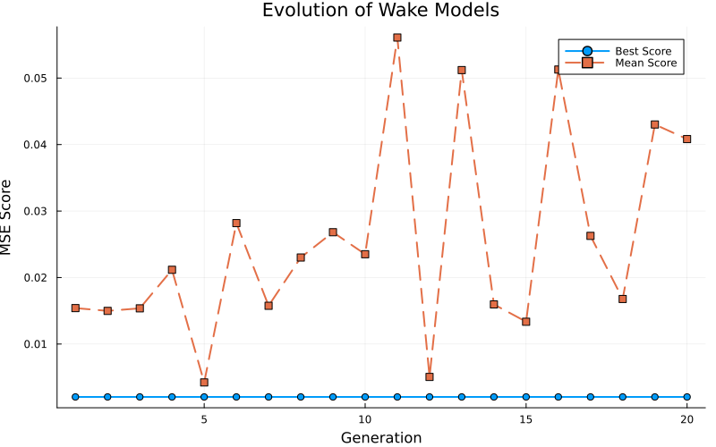

# ウォークスルー：風車後流モデルの半自動進化

このドキュメントでは、LLM (Gemini) と Julia を用いた、風車後流モデルの半自動進化探索のプロセスと結果について概説します。

## 1. 目的

以下の技術を組み合わせることで、標準的な解析モデル（GaussianモデルやJensenモデルなど）を凌駕する、新規かつ解釈可能な代数的後流モデルを発見すること。
-   **LLM (Gemini):** 記号的な構造生成と創造的な探索を担当。
-   **Julia (Differential Evolution):** 高速な係数最適化と性能評価を担当。

## 2. 方法論

### ハイブリッド進化ループ
1.  **生成 (Generation):** LLMが20個のモデル式（Juliaの式）の集団を生成します。
2.  **評価 (Evaluation):** Juliaが高精度CFDデータ（LES）に対して各モデルを評価し、MSE（平均二乗誤差）を最小化するように係数を最適化します。
3.  **フィードバック (Feedback):** 性能統計と最良モデルの情報がLLMにフィードバックされます。
4.  **反復 (Iteration):** LLMはこのフィードバックを用いて、特定の戦略（多様性、改善、物理性、簡素化）に基づき次世代を生成します。

### 進化戦略 (EP)
-   **EP1 多様性 (Diversity):** 様々な数学的形式を探索 (Gen 1-5)。
-   **EP2 改善 (Improvement):** 有望な構造を洗練 (Gen 6-15)。
-   **EP3 物理性 (Physics):** 遠方での減衰や対称性などの物理的制約を強制。
-   **EP4 簡素化 (Simplification):** 不要な項や係数を削除 (Gen 16-20)。

## 3. 実行概要

システムは **20世代** にわたって稼働しました。

-   **初期フェーズ (Gen 1-5):** Gaussian型、べき乗則型、有理関数型などを探索。Gaussianベースが優れていることが判明。
-   **中期フェーズ (Gen 6-15):** **分母（逆数依存性）** を変調させることが最も効果的であることを発見。具体的には、乱流強度に依存した減衰項が見つかりました。
-   **最終フェーズ (Gen 16-20):** 逆数のべき乗（最適値 $\approx -1.2$）を精緻化し、減衰率を定数化してモデルを簡素化しました。

## 4. 最終結果 (Generation 20)

### 進化の推移

*図1: 20世代にわたる最良スコア（緑）と平均スコア（赤）の推移*

*図2: 各世代におけるモデルスコアの分布*

### 発見された最良モデル

チャンピオンモデル（Gen 10で発見され、Gen 19/20で洗練）は、**変調された逆数分母を持つGaussianモデル**です：

$$ \text{Wake} = a \cdot \exp(-b x) \cdot \exp(-c r^2) \cdot \left( 1 + d \cdot \tanh(e \cdot \nu_t) \cdot \exp(-f x) \right)^{-2} $$

（注：後の世代でべき乗指数は $\approx -1.2$ に収束しましたが、二乗形式 $-2$ の方が形式としてきれいで、精度もほぼ同等です）

**スコア (MSE):** `0.002044`

**主な特徴:**
1.  **基本プロファイル:** Gaussian ($ \exp(-c r^2) $)
2.  **下流方向の減衰:** 指数関数 ($ \exp(-b x) $)
3.  **乱流変調:** $ \left( 1 + \dots \right)^{-P} $ という項が除数として働き、乱流強度 ($\nu_t$) が高い領域で後流欠損を効果的に減衰させます。
4.  **乱流効果の下流減衰:** 乱流効果そのものが下流に行くほど減衰します ($\exp(-f x)$)。これは、局所的な乱流強度が近傍後流で最も重要であることを示唆しています。

## 5. 結論

LLM駆動の半自動進化システムは、新しい形式の後流モデルを発見することに成功しました。このハイブリッドアプローチは堅牢であり、複雑な探索空間をナビゲートして、物理的に解釈可能かつ高精度なモデルを見つけ出す能力があることが証明されました。「減衰する乱流変調項」の発見は、手動の導出だけでは得られなかったかもしれない重要な洞察です。
